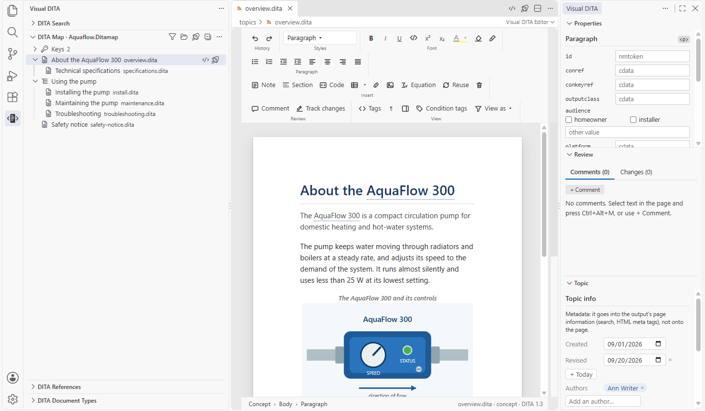
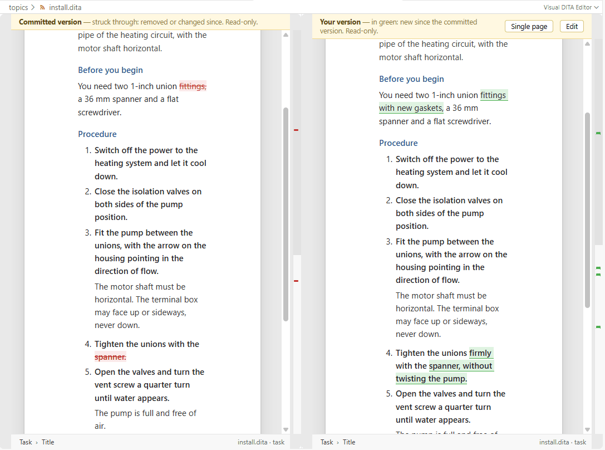

<!-- Copied from the extension's README.md by scripts/sync-public.mjs. Edit it there, not here. -->
<h1 align="center">
  <br>
  Visual DITA
</h1>

<p align="center">
  <a href="https://marketplace.visualstudio.com/items?itemName=pleosoft.visualdita">VS Code Marketplace</a> ·
  <a href="https://visualdita.com">visualdita.com</a> ·
  <a href="https://github.com/PleoSoft/visualdita-docs/issues">Issues</a>
</p>

**Write DITA the way you write in Word — inside VS Code.**

Visual DITA opens `.dita` topics as a page you type on, `.ditamap` and `.bookmap` files as an outline, and
`.ditaval` files as a form — not as XML you edit by hand. The structure is still DITA, still valid, still yours:
the editor is driven by the document type of the file you opened, so it only ever offers what your document type
allows — including your own specializations.

Subject-matter experts get a word processor. Information architects get the XML they asked for, byte for byte
where nothing changed.



**Standard DITA is free.** Every feature — the page editor, maps, tables, review, comparisons with Git, the checks and
the agent tools — works on the standard OASIS DITA document types, on any number of computers, for any use, commercial
authoring included. **Your own document types** (specializations and constraints) are supported too: they come from
Pleosoft as a licensed Visual DITA package, and that licence is the paid part — see
[Your document types](guide/document-types.md). Installing or using Visual DITA means accepting its
[licence agreement](LICENSE.md).

The **[user guide](guide/README.md)** shows how to use it, step by step, with screenshots.

> **Beta.** Everything below works today and is covered by tests, but the extension is young. Back up your
> content, keep it in version control, and tell us what breaks: <https://github.com/PleoSoft/visualdita-docs/issues>

## What you get

**A page, not a tree.** Paragraphs, lists, tables, notes, figures and images render as themselves. Enter behaves
the way a writer expects — a new paragraph, a new step, a new list item; in an empty element it steps out, the
way a second Enter leaves a list in Word. Ctrl+Enter gets you out of a note, a section or a table. Backspace and
Delete remove an empty element whole instead of leaving an empty shell behind.

**Word's habits, DITA's rules.** A mini toolbar over the selection (bold, italic, underline, monospace, a colour
palette, alignment), a ribbon, a right-click menu that offers only what the grammar allows at that spot, and a
breadcrumb showing where you are. Paste from Word or a browser and the HTML becomes DITA structure, not a wall
of text.

**Tables that behave.** CALS (`table`) and simple tables (`simpletable`, choice tables, properties) render as
real tables with spans. Merge and split cells, insert and delete rows and columns, set a header row, Tab between
cells. Drag a column border to set its width and it is written as DITA expresses it — `colspec/@colwidth` or
`@relcolwidth`. `@align`, `@valign`, `@frame`, `@colsep`/`@rowsep` and `@keycol` are drawn on the page, not just
stored.

**Review, compatible with Oxygen.** Comments and tracked changes are stored in the topic in Oxygen's own markup,
so a file reviewed here opens with its comments and changes intact in Oxygen, and the other way round. Reply,
resolve, accept and reject from the Review pane; **No markup** shows the text as if every change were accepted. A
team that reviews through Git switches Track changes off for the project with `visualDita.trackChanges`.

**Compare with Git.** Where a topic is in Git, the toolbar's **Compare** group compares it with the last commit,
any earlier version or another branch: **Single page** marks the changes on your page — new in green, removed
struck through — and **Side by side** puts the two versions next to each other, scrolling together. A diff from
Source Control reads the same way when you open it in Visual DITA: your changes, staged changes, one commit
against another. Changed words, paragraphs, table rows and cells, formatting and attributes are all marked.



Both are described case by case in **[Review and compare](guide/review-and-compare.md)**.

**Maps as an outline.** A `.ditamap` opens as a navigation pane: drag rows, indent and outdent, add topics,
headings and key definitions, fold subtrees, edit relationship tables in place, and open a topic beside the map.
Titles are resolved from the referenced files and from keys.

**Everything a DITA project actually uses.** Keys and key scopes, conref and conkeyref (reused content is shown
resolved and read-only, one click opens its source; ranges with `conrefend`; pushes with `conaction` shown for
what they are), **Reuse** to insert content by key or from a file, links with a target picker, images (sized as
DITA says — `@width`, `@scale`, `@scalefit` — and resized by dragging a corner), **Where Is This File Used**, id
refactoring, topic and map templates (including Oxygen framework templates), condition sets from your `.ditaval`
files — a topic under a `ditavalref` branch previews through that filter by itself — and subject schemes.
Glossary entries render as entries; a `term` or `abbreviated-form` by key reads as the glossary says. Footnotes
are numbered where they are written, index terms are small markers you can see and edit. The **DITA References**
view lists what a topic uses — keys, conrefs, links, images — and what uses it. Rename or move a topic, map, image or
folder in the Explorer and the references follow: the maps' entries and key definitions, links, reuse and images
pointing at it, and a moved file's own — shown first if you want, every file as it is and as it would be.
**Check References** lists what does not resolve in a topic or map, or in the whole project: a file or image not
there, an id a link or conref names that is not in its file, a key no map defines, a link to a topic no map
publishes — each a click from its line, and up to date when files are renamed or deleted outside VS Code.

**Equations and drawings.** MathML and SVG render as themselves — inline formulas, numbered equation figures,
`mathmlref`/`svgref` files. **Equation** inserts one; right-click a formula to write it in **LaTeX** with a live
preview (stored as MathML, the LaTeX kept in the file for the next edit) or to edit the MathML itself.

**Questions and answers.** Learning assessments (true/false, single and multiple choice, sequencing, matching,
open questions) render as numbered question cards with the right answers marked. Mark or unmark an answer,
add feedback, press Enter for the next option, insert a new question from a template — both generations of the
learning domain, and specializations of them.

**Project health.** **Visual DITA: Project Health Report** looks at the whole doc set: each map's size in topics and
words, broken links, undefined keys, topics no map publishes and images nobody uses — every file one click away.

**Conditions.** Select words and choose **Condition…** to tag them for an audience, platform or product, from
your subject scheme's values or the ones already in use; **Conditions ▾ → Show condition tags** shows every
conditional element's values on the page, and a condition set (`.ditaval`) previews what an output keeps.

**Topic info.** The metadata (prolog) is not on the published page, so it is not on yours either: it is in the Topic
pane, next to Properties and Review. Created and revised dates with date pickers, authors and keywords as chips
(yourself with one click), the product and its version; template placeholders shown as what they are. "Show on
the page as elements" brings the prolog back on the page as it is in the file. A map's metadata is in the same pane
as **Map info** (a bookmap's as **Book info**): its short description, dates, authors and keywords, and for a book
its rights owner, copyright years, ISBN and publisher. It is off the map page the same way, and back with the same
switch.

**Authoring rules.** Beyond the grammar: a topic without a short description (or with one over 50 words), an empty
paragraph, a key no map defines, a reference to a file that is not there, a profiling value outside the subject
scheme, an image without alt text, a duplicate id, a URL link without `scope="external"`, leftover draft content,
a table row with the wrong number of cells. Shown on the page and in the Problems panel, for a topic open as a
page or as XML; switch any off with `visualDita.rulesOff`. A topic without a short description shows a faint
**Short description** line under its title: click it, or press Tab in the title, and type. In the XML, the quick fix
**Add a short description** does the same.

**Your document types.** The OASIS document types of DITA 1.0, 1.1, 1.2 and 1.3 are built in, and free. A document
opens on the version its DOCTYPE names, and one that names none on your project's DITA version (1.3 unless you set
`visualDita.ditaVersion`), so a DITA 1.2 project is offered DITA 1.2 and nothing it cannot use. The DITA 2.0 draft
is built in too, for projects that load it. Each version is loaded or unloaded for your project in the **DITA
Document Types** view; a file of a version that is not loaded opens as base DITA and says NOT LOADED.
Your own specializations come from Pleosoft as a licensed Visual DITA package (a signed `.vdpkg` file, see below) —
the page, the insert menus and the validation all follow them. Oxygen Author CSS from your framework is applied where
it is plain CSS; **Visual DITA: Turn Framework Styling On or Off** takes it away if a page ever looks wrong.

**Standard DITA renews every year, free.** The standard DITA in Visual DITA works until 31 December (hover
**Standard DITA** in the DITA Document Types view for the date), and each year's renewal comes from October: an
update of Visual DITA, which the Marketplace and Open VSX install by themselves, or a download from
[visualdita.com](https://visualdita.com/install.html#renewal) that **Import Visual DITA Package…** adds once, for
every project. Visual DITA reminds you from 1 November. Your files stay plain DITA whatever happens: editing them as
XML, and using them with any other tool, is never restricted.

The status line at the bottom of the page says which grammar the document actually got; click it to see the
DOCTYPE, where its grammar came from and the packages in use. **Visual DITA: Reload Grammars** reads the packages
again and refreshes every open page without reopening.

**Valid as you type.** Each document is checked against its document type — standard DITA, or your package's —
for its elements, their order, attributes and values, and each problem shows on the element it belongs to, with
the count in the page's status line and the list in the Problems panel. Edited as XML, it completes the elements
allowed where you type, their attributes and their values. Nothing else to install: no XML extension, no Java.

**Lossless.** Only the elements you touch are rewritten. Indentation, comments, processing instructions, entity
references and attribute order everywhere else survive untouched — a diff shows your edit and nothing else.
**Open Source** (right-click, or the command palette) shows the XML at any time, and edits there flow back into
the page; **Open in Visual DITA** in the editor's title bar goes back.

**Tools for your AI assistant.** Visual DITA offers an MCP server to the editor, so an agent can ask about
*your* vocabulary instead of guessing at base DITA: what elements your document types actually declare, what an
element specializes, what a key resolves to, what references a file, and whether a draft checks out against the
grammar it really uses. It also knows your project: your templates, content already written for reuse, the
condition values you use, and the project's health. It runs locally and contacts nothing.

## Getting started

The [user guide](guide/getting-started.md) walks through it with screenshots; in short:

1. Install the extension. Standard DITA works at once, with nothing else to install.
2. Open a folder with DITA content. `.dita` files open in Visual DITA, `.ditamap` and `.bookmap` files as an
   outline.
3. To open a file as XML instead: right-click → **Open With…** → *Text Editor*, or the **Open Source** command.
4. Set `visualDita.author` to the name you want on your comments and tracked changes.

**Your own document types** come from Pleosoft as a Visual DITA package: one `.vdpkg` file, signed, holding
your specialization's grammars and its licence. Add it with **Import Visual DITA Package…** in the **DITA
Document Types** view: it is checked and copied into `.dita/` of your project. Visual DITA never reads your DTDs
or catalogs.

**Your framework's templates and styling.** Run **Visual DITA: Use Framework Templates and CSS…** and pick the
folder your templates and Oxygen Author CSS live in (an Oxygen framework or a DITA-OT plugin folder, typically) —
usually one folder shared by the whole company, not something beside the content. It adds the template folders
to `visualDita.templates` and the CSS to `visualDita.css` in the workspace settings, so they travel with the
project. It takes whichever of the two it finds, so a framework kept in several places is several runs: the
settings are lists and it appends. It is also in the Explorer: right-click a folder → **Visual DITA** → **Use
Framework Templates and CSS…**.

The settings it fills are ordinary ones, if you would rather write them yourself:

```jsonc
// .vscode/settings.json
{
  "visualDita.templates": ["../framework/templates"],
  "visualDita.css": ["../framework/css"]
}
```

Absolute paths work too, for a framework on a share. In a folder VS Code does not trust (Restricted Mode), Author
CSS from the workspace is not applied — the page could reach the internet through it — until you trust the folder;
your Visual DITA packages, signed and verified, work either way.

The **DITA Document Types** view in the Visual DITA side bar shows what the editor uses: every document type your
documents use and where each comes from (standard DITA, your licensed package, or *not licensed* / *unknown
document type*, shown first), then what is loaded — your Visual DITA packages, who they are licensed to and until
when, and each version of standard DITA. The changes it makes: adding a package (**Import Visual DITA Package…**),
unloading one (for you, in this workspace; the file stays and can be loaded again), and loading or unloading a DITA
version, or making one the project's version (for the project, in its settings).

## Settings

| Setting | What it does |
|---|---|
| `visualDita.author` | Name written into comments and tracked changes. Empty: your OS user name. |
| `visualDita.trackChanges` | Offer Track changes. A team reviewing through Git turns it off in the project's settings; tracked changes already in a file still show, to accept or reject. |
| `visualDita.validation` | Check documents against their document type, and complete elements, attributes and values in the XML. The authoring rules are switched off separately. |
| `visualDita.rulesOff` | Authoring rules to switch off: `shortdesc`, `empty`, `subject-scheme`, `keys`, `files`, `alt`, `ids`, `external-scope`, `draft`, `table`, `tracked` (tracked changes left in a file when `visualDita.trackChanges` is off). |
| `visualDita.ditaVersion` | The DITA version, 1.0 to 1.3, of documents whose DOCTYPE names none (`-//OASIS//DTD DITA Task//EN`, as most do). A DOCTYPE naming a version always gets that version; a document type your version lacks opens on the next version up that has it. Default: 1.3. |
| `visualDita.standardDita` | The built-in DITA versions your project uses: 1.0 to 1.3 unless you unload one, and the DITA 2.0 draft (`2.0-draft`) only when you load it. Set by **Load** and **Unload** in the DITA Document Types view. |
| `visualDita.packages` | Where your Visual DITA packages (signed `.vdpkg` files) are: files, or folders directly holding them. Default: `.dita` and the project folder. |
| `visualDita.rootMap` | Root map used to resolve keys. Empty: the map that reaches the document. |
| `visualDita.updateReferences` | When you rename or move a topic, map, image or folder in the Explorer, update the references to it and a moved file's own: `prompt` (ask, with **Show Changes First**), `always` or `never`. Keys and fragments stay as they are. |
| `visualDita.templates` | Folders with topic and map templates for **New Topic from Template…** and **New Map from Template…**. The standard DITA types and your personal templates (`~/.visual-dita/templates`, filled by **Save as Template…**) are always offered too. |
| `visualDita.css` | Oxygen Author CSS files or folders applied to the page. |
| `visualDita.panes` | Where the Properties, Review and Topic panes live: `vscode` (the Visual DITA container of the secondary side bar) or `page`. |
| `visualDita.mapViewOnOpen` | Whether opening a map switches the side bar to the DITA Map view: `ask`, `always` or `never`. |
| `visualDita.autoIds` | Element classes that get an id when inserted, so they can be conref'd. |

## When your own elements are not offered

The page's status line reads `NOT LICENSED` when the document's DOCTYPE is not standard DITA and no package in use
licenses it: the page opens it as base DITA, so your specialized elements are not in the menus. The **DITA
Document Types** view says why for each (no package has it, its licence ended, the package was unloaded…); contact
Pleosoft for a package, and add it with **Import Visual DITA Package…**. `FALLBACK GRAMMAR` means the document
names no grammar Visual DITA has — no DOCTYPE, a DOCTYPE with only a system id, or a standard one it does not know:
it opens on the built-in shell matching its root element, and is not validated.

**Visual DITA: Check Grammars in Workspace** asks the same question of the whole doc set at once: every DOCTYPE it
declares, which of them resolved and to which package or standard DITA shell, and — first in the report — the
ones that did not, with the documents they cost. Worth running when a doc set arrives, before anyone concludes
their elements are unsupported.

## Agent tools (MCP)

The extension registers an MCP server with VS Code — it appears in the editor's MCP list and starts on demand,
so "stopped" before anything has used it is normal. Twelve tools, all read-only and all answering from the
grammars your project actually resolves to:

| Tool | Answers |
|---|---|
| `dita_vocabulary_overview` | every element this doc set may use, by domain, with what each specialization derives from |
| `dita_describe_element` | one element: content model, attributes and their allowed values, what accepts it |
| `dita_search_vocabulary` | find an element or attribute by part of its name |
| `dita_check_topic` | the document checked against the grammar it resolves to, with the editor's own checker, then the authoring rules, each finding with its line |
| `dita_grammar_health` | which DOCTYPEs resolve to a grammar, and which fall back to base DITA |
| `dita_resolve_key` | what a key means here, through DITA 1.3 key scopes; without a key, every key in scope with its text and target |
| `dita_where_used` | everything referencing a file, an id or a key |
| `dita_map_tree` | the map as a tree of resolved titles |
| `dita_project_health` | the Project Health report: map sizes, broken links, undefined keys, topics in no map, unused media |
| `dita_templates` | your templates, and a new topic or map filled in from one the way the editor does it |
| `dita_profiling_values` | the values audience, platform, product… may take (subject scheme, else those in use), and the condition sets |
| `dita_find_reusable` | content with an id containing some words, with the conref or conkeyref to reuse it |

Every vocabulary answer names the grammar it came from, so an agent reading a fallback can tell.

The server follows the project's settings — `visualDita.packages`, `templates`, `rootMap`, `rulesOff`,
`trackChanges`, `ditaVersion` and `standardDita` — so an agent gets the answers the editor would give. Started by VS Code, it is handed the editor's
settings and restarted when one changes; started on its own, it reads the project's `.vscode/settings.json`, the
settings the team shares (one only in your user settings cannot reach it there). With none set, it uses the
packages in `.dita/` and the project folder, every `templates` folder in the project and your personal templates,
and the first root map — what the editor uses when nothing is configured.

For an agent outside VS Code, the same binary runs standalone with Node.js and needs no configuration:

```
node <extension>/out/server.js --mcp --root /path/to/doc-set
```

**Visual DITA: Set Up Agent Tools** writes the wiring into the doc set:

| File | What it does |
|---|---|
| `AGENTS.md` | a short block — read on every task by agents that follow the `AGENTS.md` convention (Codex, Cursor and others) — saying the vocabulary is this project's own, naming the tools, and stating the rules that hold with or without them: change only what you were asked to, leave processing instructions alone, do not renumber ids |
| `.claude/skills/dita-authoring/SKILL.md` | the detail, loaded only when someone is authoring DITA: what order to call things in, and what not to do |
| `.dita/mcp-server.cjs` | a small launcher: it finds the Visual DITA extension installed on the machine that runs it (VS Code, Insiders, VSCodium, Cursor, Windsurf, a remote server's) and starts its server for this project |
| `.mcp.json` | the server entry — `node .dita/mcp-server.cjs --mcp`, no path of anyone's machine — so Claude Code outside the editor can start it (it asks you once to approve it) |

Your own words are kept: our block in `AGENTS.md` sits between markers and is rewritten in place, and a server
somebody else put in `.mcp.json` is left as it was. Running it twice changes nothing. Commit the files, and the
whole team's agents follow the same rules and find the same tools, on every machine and after every update. Start
the agent in the project folder, where `.mcp.json` is.

## Requirements

- VS Code 1.106 or newer.
- Nothing else: no XML extension, no Java, no server. Validation and completion come from Visual DITA itself.
  An XML extension you already use (Red Hat XML, DitaCraft) does not know Visual DITA's grammars; when it reports
  problems in a DITA file, Visual DITA offers once to disable it for that workspace. `visualDita.validation`
  switches Visual DITA's own checking off.
- Git, for comparisons: VS Code's built-in Git support, on by default.
- Node.js, only to run the agent server standalone outside VS Code.

## Privacy

Visual DITA collects nothing and sends nothing anywhere. It reads and writes the files in your workspace, the
folders your settings point at, and its own folder `~/.visual-dita` (your personal templates, the standard DITA
renewals you import, and the date of the last licence check). Nothing leaves your machine. VS Code's own telemetry settings are unaffected by it.

Visual DITA's one compiled module, `out/vd-core.wasm`, is Pleosoft's own code: it runs inside VS Code's JavaScript
engine, like the rest of the extension, with no access to your files or the network.

## This repository

This is where Visual DITA is documented and where you report bugs and ask for features. The extension itself
is distributed through the VS Code Marketplace; its source is not published here.

## Support

Questions and bug reports: <https://github.com/PleoSoft/visualdita-docs/issues>.
More about the product: [visualdita.com](https://visualdita.com).

## Licence

Copyright © 2026 [Pleo Soft d.o.o.](https://pleosoft.com) All rights reserved.
Installing or using Visual DITA means accepting its licence agreement, [LICENSE.md](LICENSE.md); third-party
components are listed in [THIRD-PARTY-NOTICES.md](THIRD-PARTY-NOTICES.md).

DITA is an [OASIS](https://www.oasis-open.org/) standard; the bundled DTDs are OASIS's, used under their notice.
