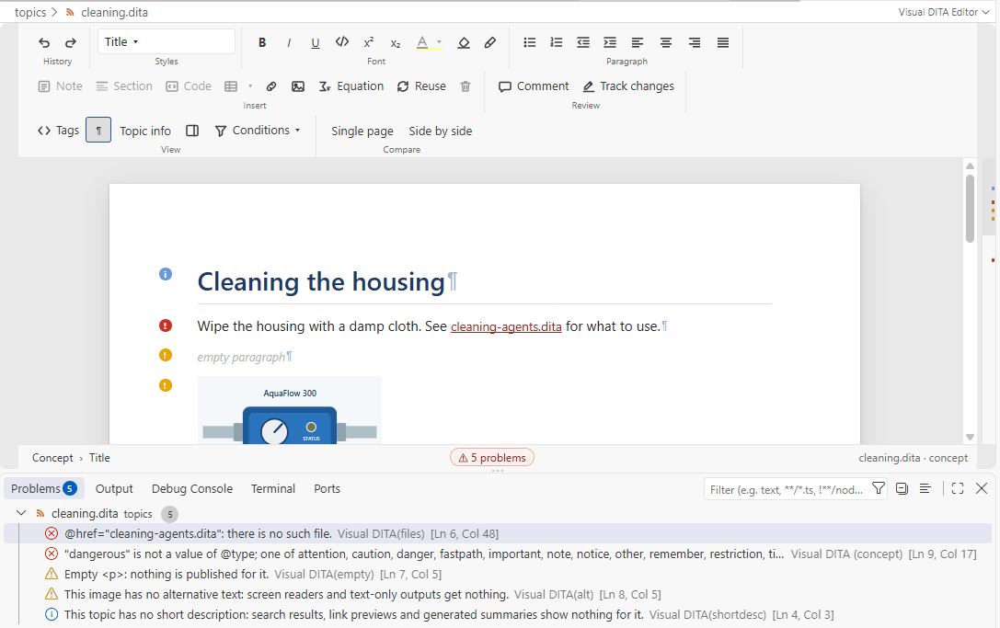
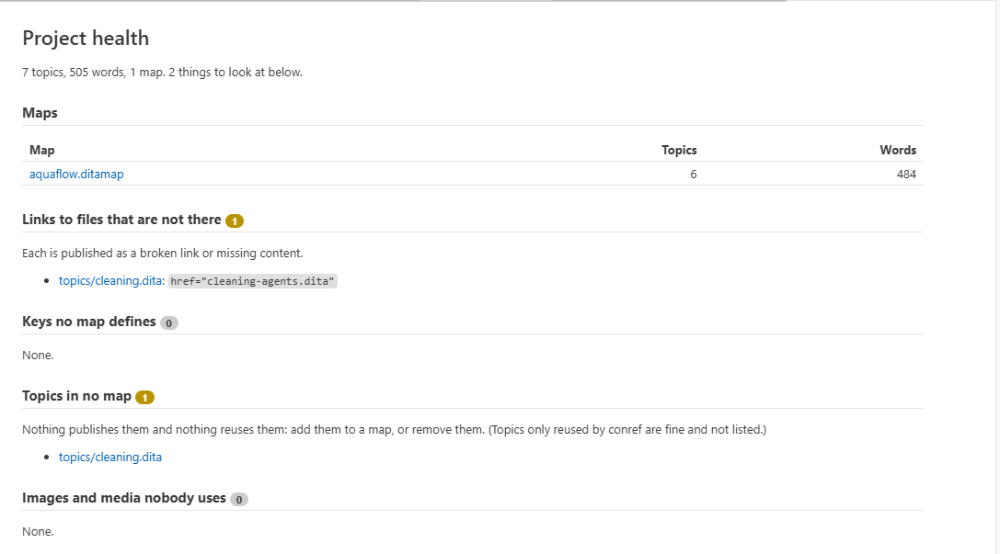
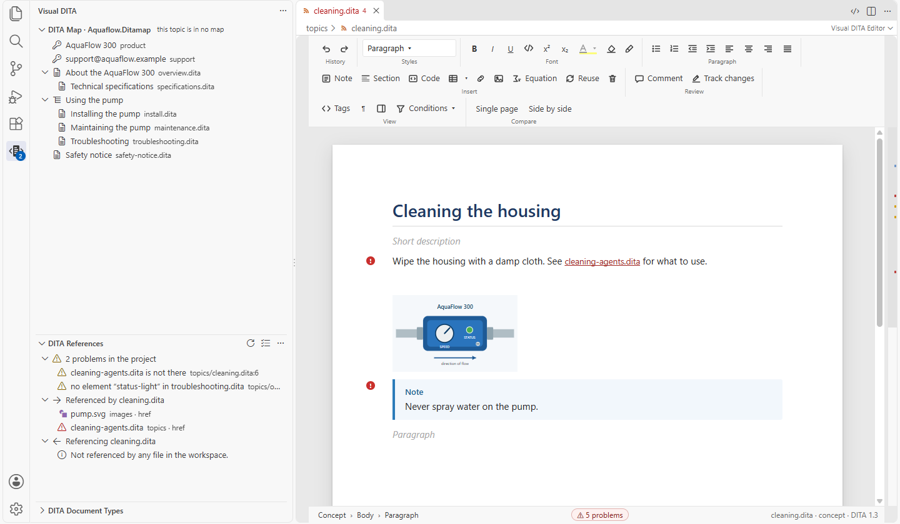

# Checking your content

[User guide](README.md) › Checking your content

Visual DITA checks each topic while you write, against two things: its document type (the grammar: which elements
go where, which attributes and values are allowed) and a set of authoring rules (what a good topic has, beyond what
the grammar requires).

## Where problems show

- **On the page**, on the element they belong to: errors underlined in red; with the formatting marks (**¶**) on,
  a marker in the margin for each problem, warnings and notes included.
- **In the page's status line**: how many problems the topic has. Click it to go to the next one.
- **In VS Code's Problems panel** (**Ctrl+Shift+M**): every problem with its line, for the topics you have open —
  as a page or as XML.

## The grammar

The check follows the topic's own document type — standard DITA, or your licensed package — exactly: elements, their
order, attributes and their values. A topic whose document type Visual DITA does not have is not checked against a
stand-in, because every element of your own would be reported (see [Your document types](document-types.md)).
`visualDita.validation` switches the grammar check off.

## The authoring rules

Beyond the grammar, the rules point out:

| Rule | Points out |
|---|---|
| `shortdesc` | a topic without a short description, or with one over 50 words. On the page, a faint **Short description** line under the title adds one (click it, or press Tab in the title); in the XML, the quick fix **Add a short description** does |
| `empty` | an empty title, paragraph, list item, note or section |
| `keys` | a key no map defines |
| `files` | a link or reference to a file that is not there |
| `reuse` | a conref or conkeyref that pulls an element of another type (a paragraph reusing a step: an element reuses its own type or a specialization of it), or content with elements your document type does not have |
| `subject-scheme` | a profiling value your subject scheme does not allow |
| `alt` | an image without alternative text |
| `ids` | an id used twice in a topic |
| `external-scope` | a link to a web address without `scope="external"` |
| `draft` | draft comments and required-cleanup, which the output leaves out |
| `table` | a table row with the wrong number of cells |
| `tracked` | tracked changes left in a file when the project does not track changes |

Switch any of them off for a project with `visualDita.rulesOff`, for example
`"visualDita.rulesOff": ["shortdesc", "draft"]`.

## The whole project

**Visual DITA: Project Health Report** (Command Palette, or the pulse button in the DITA Map view) looks at the whole
doc set: each map's size in topics and words, links to files that are not there, keys no map defines, topics no map
publishes, and images nobody uses. Every file is a link that opens it.

**Check References**, the checklist button of the **DITA References** view, lists at the top of the view what does
not resolve in the topic or map you are on: a file or image that is not there, an id a link or conref names that is
not in its file, a key no map defines, a conref that names no element, and a link to a topic no map publishes (it
goes nowhere once published). Each opens the source at its line; the count shows on the view. **Check References in
the Whole Project**, in the view's menu, does the same for every topic and map. Links to web addresses, and those
marked `scope="peer"` (another doc set), are left alone. A file renamed, moved or deleted outside VS Code (by Git, or
another program) shows at once: the DITA Map view marks its entry as not there, the topics linking to it show the
problem, and a check listed in the view runs again.

**Visual DITA: Check Grammars in Workspace** asks one more question of the whole doc set: which document types its
files declare, and whether each one resolves to standard DITA or to a licensed package. Run it when a doc set arrives,
before anyone concludes their own elements are not supported.

## When you edit the XML

With a topic open as XML (**Open Source**), the same checks run, and Visual DITA completes the elements allowed where
you type, their attributes and their values. Ctrl+click on a `keyref`, `conref` or `href` goes to its target, and
hovering one shows what it resolves to.

- **F2** on an id, a key, or a reference to one renames it and every reference in the project; **Ctrl+Enter** in
  the rename box shows every change first.
- **Shift+F12** lists every place an id or a key is used, the key/element and `#./element` forms included.
- The **Outline**, the breadcrumbs and sticky scroll follow the file's structure: topics, sections, figures and
  tables by their titles; a map's entries, headings and key definitions.

## In the Explorer, and anywhere

The Explorer marks each topic and map: how many of its references do not resolve (what **Check References** lists),
**!** for a document type no Visual DITA package licenses, and a topic no map uses greyed. Hover one to read why.
The project is looked at again whenever you save or files come or go; `visualDita.explorerBadges` turns the marks off.

**Go to Symbol in Workspace** (**Ctrl+T**) finds a topic, section, figure or table by its title, a map by its title,
a key, or an id (type `#` and the id) anywhere in the project.

Next: [Your document types](document-types.md).
