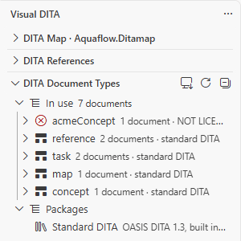
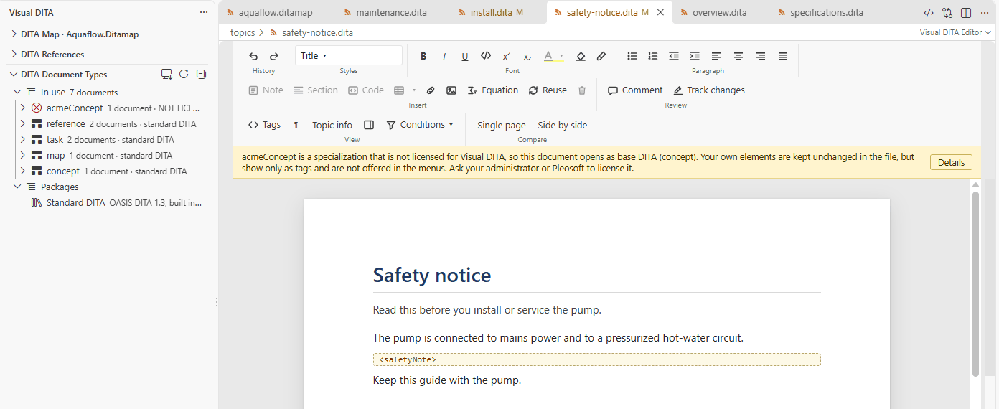
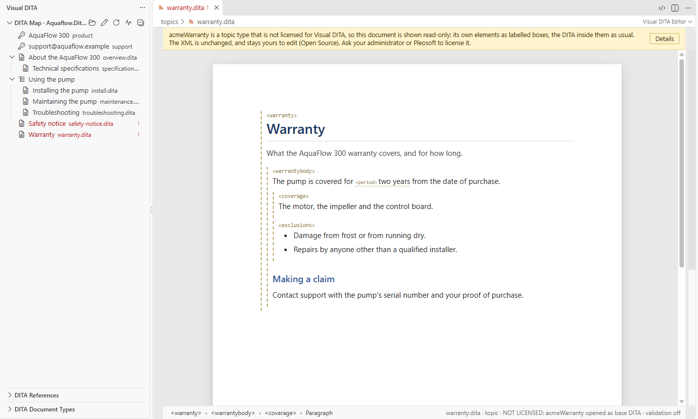

# Your document types

[User guide](README.md) › Your document types

Every DITA file names its document type in its DOCTYPE (`<!DOCTYPE task PUBLIC "-//OASIS//DTD DITA Task//EN" …>`),
or, written for RELAX NG, in an `<?xml-model?>` at its top, and Visual DITA works from that document type: it decides what the page offers, what the menus contain and what the
check reports.

## Standard DITA: built in, and free

The OASIS document types of DITA 1.0, 1.1, 1.2 and 1.3 — topic, concept, task, reference, glossary, map, bookmap,
learning and training, machinery task, troubleshooting and the rest — are built in, and so is the DITA 2.0 draft.
They cost nothing: every feature of Visual DITA works on them, on any number of computers, for any use, commercial
authoring included. Nothing to install, nothing to configure.

### Which DITA version

A DOCTYPE that names a version gets that version: `-//OASIS//DTD DITA 1.2 Task//EN` opens on DITA 1.2, whatever the
rest of the project uses. Most DOCTYPEs name none (`-//OASIS//DTD DITA Task//EN`), and those open on your project's
DITA version: DITA 1.3, unless the setting **DITA version** (`visualDita.ditaVersion`) says otherwise. Set it in the
project's settings, `.vscode/settings.json`, so that everyone who works on the project gets the same:

```json
{ "visualDita.ditaVersion": "1.2" }
```

The version decides what the page, the insert menus and the check offer: in a DITA 1.2 project you are not offered
`<div>` or anything else DITA 1.3 added, and the check holds your documents to DITA 1.2. A document type your version
does not have — a troubleshooting topic in a DITA 1.2 project — opens on the next version up that has it. In a
workspace with several folders, each folder can have its own version.

The status line at the bottom of the page names the version a document got (`task · DITA 1.2`); click it to see why.

### Loading and unloading versions

Each version is loaded in your project or not, under **Standard DITA** in the **DITA Document Types** view: DITA 1.0
to 1.3 are loaded unless you unload one, and the DITA 2.0 draft is not loaded unless you load it. A file of a version
that is not loaded still opens, on base DITA, and says so: the status line reads **NOT LOADED**
(`task · DITA 1.2 NOT LOADED: opened as base DITA`), the banner above the page has a **Load** button, and the check
is off for that file. Nothing in the file is changed.

The choice is saved in the project's settings (`visualDita.standardDita` in `.vscode/settings.json`), so everyone who
works on the project gets the same, and **New Topic from Template** offers only templates of versions that are
loaded. In the same view, **Use as the Project's DITA Version** sets the version for files whose DOCTYPE names none.

**DITA 2.0 is a draft**, not yet an OASIS Standard. Visual DITA includes its current release (OASIS beta 03) for
projects that want to start with it: load **DITA 2.0 draft**, and files whose DOCTYPE or schema names DITA 2.0
(`-//OASIS//DTD DITA 2.0 Concept//EN`, or `urn:pubid:oasis:names:tc:dita:rng:concept.rng:2.0`) open on it, with
the page, the menus and the check following DITA 2.0. Its grammars may still change before OASIS approves it.

### A free renewal every year

The standard DITA in Visual DITA works until 31 December: hover **Standard DITA** in the **DITA Document Types** view
to see the date. Each year's renewal is free and comes from October:

- installed from the Marketplace or Open VSX, the update that carries it arrives by itself;
- otherwise, download it from [visualdita.com](https://visualdita.com/install.html#renewal) — five files, one per DITA
  version, into one folder — and pick any one of them with **Import Visual DITA Package…** in the DITA Document Types
  view: the others come with it. It renews standard DITA for you, in every project; nothing is added to the project.

From 1 November Visual DITA reminds you, and the view shows the date. If the date passes without a renewal, a DITA
file opens on a message instead of the page, with the download and **Open Source**. Your files are unchanged: editing
them as XML, and using them with any other tool, is never restricted.

## Specializations: licensed

Many organizations have document types of their own: specializations, which add elements (a hazard statement, a
product-specific block), and constraints, which leave some out. Visual DITA supports them fully — the page draws your
elements, the insert menus and the styles list offer them where your grammar allows, and the check follows your
grammar — through a **Visual DITA package**.

A package is one file (`.vdpkg`) that Pleosoft prepares from your document types, written as DTDs or as RELAX NG:
their grammars, compiled, with a licence in your name, signed. Add it with **Import Visual DITA Package…** in the **DITA Document Types** view: it is
checked and copied into the `.dita` folder of your project, so it travels with the project for everyone who works
on it. Visual DITA never reads your DTDs, RELAX NG or catalogs themselves.

A topic finds its document type in your packages by what it names: its DOCTYPE's public id (or, with none, the DTD's
file name), or its `<?xml-model?>`: the URN your catalog gives the shell, or a path, which goes to the package whose
shell sits at the end of that path. An OASIS identifier (`urn:oasis:names:tc:dita:rng:concept.rng`) opens on
standard DITA, unless your catalog maps that very identifier to a shell of yours. When two packages have the same
public id or URN, the first is used, and the DITA Document Types view says which.

This is the paid part of Visual DITA. To license your document types, contact Pleosoft at
[visualdita.com](https://visualdita.com).

## The DITA Document Types view

The **DITA Document Types** view (Visual DITA side bar) says what the editor uses: every document type your files
declare, how many files use each and where it comes from — standard DITA and its version, your licensed package
(and until when), or *not licensed* / *not loaded* / *unknown document type*, listed first — and below, what is
loaded: your packages, and each version of standard DITA.



A licence that ends within a month is flagged there. A package can be unloaded for you, in this workspace (the file
stays and can be loaded again), and **Visual DITA: Reload Grammars** reads the packages again without reopening
anything.

## When a document type is not licensed

A file whose document type is neither standard DITA nor in a licensed package still opens, and nothing in it is lost:



- it opens on the standard document type it is built on, so the standard content — titles, paragraphs, lists,
  tables — is on the page as usual;
- your own elements are kept exactly as they are in the file, and show as tags; they are not offered in the menus;
- the banner and the status line say **NOT LICENSED**, and the DITA Document Types view says why (no package has it,
  the licence ended, the package was unloaded…);
- the grammar check is off for that file, since it would report every element of your own.

Editing the file as XML, and using it with any other tool, is never restricted. **FALLBACK GRAMMAR** is the other
readout you may see: the file names no document type Visual DITA knows (no DOCTYPE or `<?xml-model?>`, or a standard
one it does not have), so it opens on the standard type matching its root element, or read-only as below when its
root element is not a standard one.

**Visual DITA: Check Grammars in Workspace** lists, for the whole doc set, which document types resolve and which do
not, with the files they concern.

### A topic of a type of your own

A topic whose root element is yours — a `<warranty>` rather than a `<concept>` — has no standard type to open on. It
is shown read-only instead, so the whole topic can still be read:



- your elements are labelled boxes around their content, and your inline elements are labelled where they are in the
  line;
- the DITA inside them — titles, paragraphs, lists, sections — is on the page as usual;
- the status line names each element the cursor is in, yours included;
- nothing can be changed on the page, and the ribbon is hidden; the banner says so, and **Open Source** opens the XML,
  which stays yours to edit.

Once the package that has your document type is licensed, the topic opens on its own grammar and can be edited.

## Your framework's templates and styling

An Oxygen framework or a DITA-OT plugin usually also has topic templates and Author CSS. **Visual DITA: Use Framework
Templates and CSS…** (also right-click a folder in the Explorer › **Visual DITA**) takes both from the folder you
pick and adds them to the project's settings (`visualDita.templates`, `visualDita.css`): your templates are offered
by **New Topic from Template…**, and your stylesheets style the page where they are plain CSS.
**Visual DITA: Turn Framework Styling On or Off** takes the styling away if a page ever looks wrong. In a folder VS
Code does not trust (Restricted Mode), Author CSS from the workspace is not applied until you trust the folder.

Back to the [user guide](README.md).
