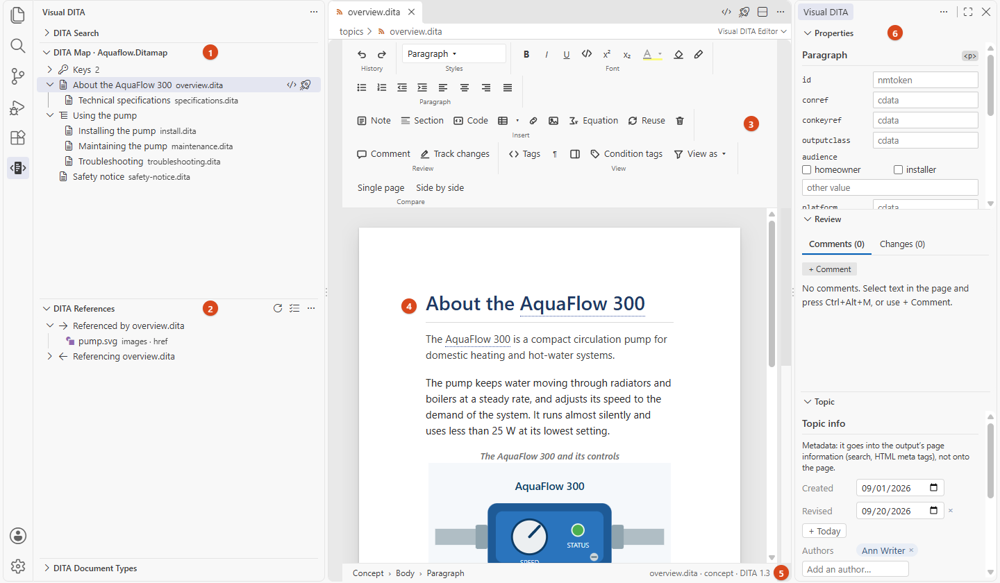
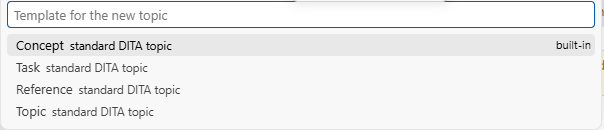

# Getting started

[User guide](README.md) › Getting started

## Install

Install **Visual DITA** from the VS Code Marketplace (Extensions view, search for *Visual DITA*). It needs VS Code
1.106 or newer and nothing else: no Java, no XML extension, no server. The standard OASIS DITA document types are
built in, so a doc set that uses them works at once, for free. Only publishing (HTML5, PDF) needs DITA-OT on your
computer, installed once: see [Publishing](publishing.md#before-your-first-publication).

## Open your content

Open the folder that holds your DITA files (**File › Open Folder…**). Then:

- a topic (`.dita`) opens as a page you write on;
- a map (`.ditamap`, `.bookmap`) opens as an outline;
- a condition set (`.ditaval`) opens as a form.

The XML is always one click away: **Open Source** (the `</>` button at the top right of the page, or right-click ›
**Open source**) shows the file as XML, and **Open in Visual DITA** goes back. Edits made in either one appear in
the other.

## Find your way around

1. **DITA Map view** — the map that publishes the topic you are on, as a tree of titles. Click a title to open the
   topic. Keys defined in the map are folded into one **Keys** row at the top.
2. **DITA References** — what this topic uses (images, links, reused content) and what uses it; **Check References**
   lists what does not resolve.
3. **The ribbon** — as in Word: History, Styles, Font, Paragraph, Insert, Review, View and, where the file is in
   Git, Compare. Buttons that do not apply where the caret is are greyed out.
4. **The page** — your topic as it reads: titles, paragraphs, lists, notes, tables, figures and images. Type on it.
5. **The breadcrumb and the status line** — the elements the caret is in (click one to select that element), and on
   the right the file, its document type, and how many problems it has.
6. **Properties, Review and Topic** — the attributes of the element at the caret, the comments and tracked changes,
   and the topic's metadata. They follow whichever topic you are working on.

The side panes live in VS Code's secondary side bar by default. Set `visualDita.panes` to `page` to have them inside
the page instead. **Ctrl+Alt+B** shows or hides the secondary side bar.

## Create a topic

Right-click a folder in the Explorer › **Visual DITA** › **New Topic from Template…**, or run the command from the
Command Palette (**Ctrl+Shift+P**).

The list has the standard DITA types, your project's templates (a `templates` folder, or the folders in
`visualDita.templates`), and your personal ones. Give the topic a title: the file is named after it
(*Cleaning the housing* becomes `cleaning-the-housing.dita`), its id and author are filled in, and it opens on the
page.
**New Map from Template…** does the same for maps and bookmaps, and **Save as Template…** turns the topic or map you
have open into a template — for the project, or only for you.

## Before you start writing

Set your name, for your comments and tracked changes: **File › Preferences › Settings**, search for
*visualDita.author*. Left empty, it is your operating-system user name.

Save with **Ctrl+S** as usual. Visual DITA rewrites only the elements you changed: everything else in the file —
indentation, comments, processing instructions, entities, attribute order — stays byte for byte as it was, so a diff
of your commit shows your edit and nothing else.

Next: [Writing on the page](writing.md).
