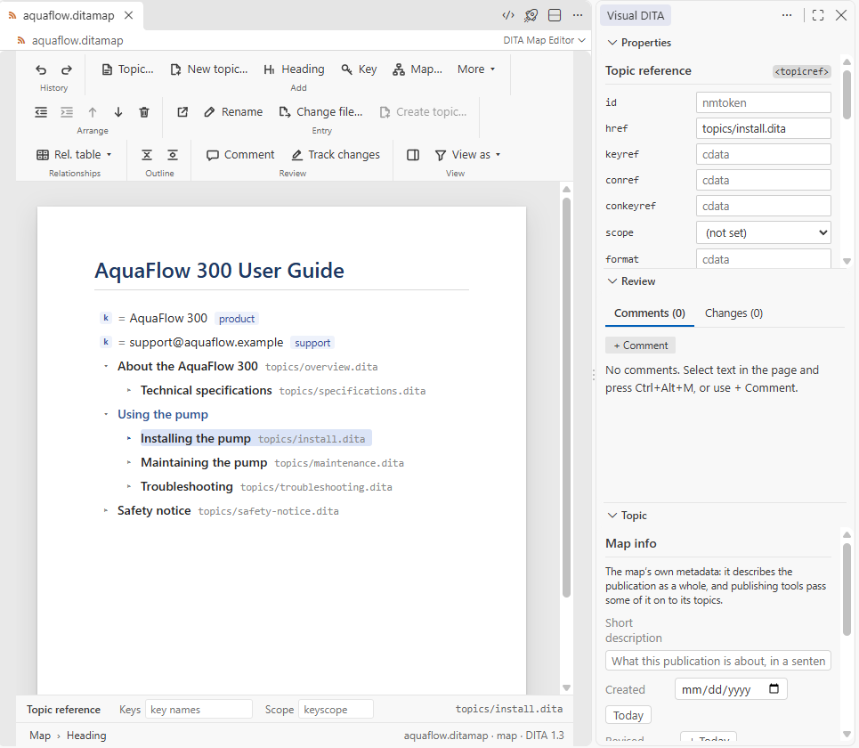

# Maps

[User guide](README.md) › Maps

A map (`.ditamap`, or a `.bookmap`) opens as an outline of titles: what the publication contains, in its order.
Titles come from the topics themselves and from keys, so the outline reads like a table of contents.

## Building the map

The ribbon's **Add** group adds, after the selected entry:

- **Topic…** — a reference to a topic that exists, picked from the project; pick several and they are added in
  name order;
- **New topic…** — a new topic from a template, created and referenced in one go, in the folder of the topics around
  it;
- **Heading** — a heading that groups entries without a topic of its own (`topichead`);
- **Key** — a key definition, for text or a target you reuse by key;
- **Map…** — another map, referenced from this one (or several);
- **More ▾** — the other entries your map's document type allows there: a group, and your own entry types (a term
  map's term groups, say). One that references a file asks for it; a group that must hold an entry asks for its first.

Right-click › **Add** offers the same.

## Writing it as an outline

A map can be written before its topics exist, as a table of contents is typed:

- **Enter** in the map's title starts it with a heading, its title ready to type;
- **Enter** at the end of a heading's title adds the next heading, as the next line (under it, when its entries are
  shown); **Tab** and **Shift+Tab** nest it or bring it out, while you keep typing; **Escape** leaves the title.

Then give the headings their topics. **Create topic…**, on a heading or right-click, makes its topic from a template,
titled as the heading, in the folder of the topics around it; the heading becomes the reference to it. Right-click ›
**Create topics for the … entries without a file…** makes them all at once, from one template.

## Arranging it

Drag an entry to move it, with everything under it. The **Arrange** group moves the selected entry up or down,
indents it under the entry above or outdents it, and removes it. **Outline** folds and unfolds the whole tree.

## An entry

Select an entry to work on it. **Open** opens its topic beside the map; **Rename** changes its navigation title;
**Change file…** points it at another file; **Create topic…**, on an entry with no file yet, makes its topic. The bar at the bottom of the page sets its keys and key scope, and the
Properties pane shows all its attributes.

**Inline into parent topic…** (right-click an entry under another topic's entry) is Extract's reverse: the entry's
topic moves into its parent's topic, and its file goes. It asks how when both can be:

- **as a section**, when the topic is that simple: no sections or topics of its own, no prolog, and used nowhere but
  under its parent. Its title becomes the section's, its short description a paragraph; a numbered entry makes a
  numbered section, so its number stays;
- **as a nested topic**, whole: its id, short description and prolog kept, at the end of the parent topic.

Its entry leaves the map, its own entries taking its place; every link and reuse that pointed at it, in maps and
topics, points where it went. What the parent's document type does not take (a task nested in a concept) is not
offered.

## The map's metadata

The map's own metadata — its `<topicmeta>`, a bookmap's `<bookmeta>` — is in the **Topic** pane, as **Map info**
(**Book info** for a bookmap): the map's short description, created and revised dates, authors, keywords, the product
and its version, and for a book its rights owner, copyright years, ISBN and publisher. It describes the publication as
a whole, and publishing tools pass some of it on to the topics. Each field is added where the map's document type
allows it, and is not offered where it does not. Like a topic's metadata it is not on the page: **Show on the page as
elements**, in the pane, puts it back as it is in the file.

## Relationship tables

**Rel. table ▾** adds a relationship table and edits it in place: rows of topics that link to each other when the map
is published.

## Conditions and branches

**View as ▾** previews the map through a condition set, or with the values you choose, as on a topic's page: what
is left out **Dimmed** or **Hidden**, as you choose in the bar above the map while you preview, values saved with
**Save as .ditaval…**, a condition set opened with **Open .ditaval**. Right-click an entry ›
**Condition…** to set its conditions, or set them in **Properties**. The topics' titles read as the set's readers get
them, a key in a title resolved under the set. As on a topic's page, what the view leaves out is kept as it is while
you preview: an entry it leaves out is not moved, removed or changed, its conditions neither, and right-click on it
offers only **Open** (**✕** stops previewing, to change it). What you choose here, the topics you open next open with, as from a topic's page. An entry that publishes a branch through its own condition set (`ditavalref`) shows it on its row, and a
topic under such a branch previews through that condition set when you open it, unless you have chosen one in
**View as ▾**.

## The DITA Map view

The **DITA Map** view in the Visual DITA side bar shows the map that publishes the topic you are working on, and
follows you as you open other topics; click a title to open that topic. With several root maps it lists them all.
A map's key definitions are folded into one **Keys** row, with how many there are, where the first of them is: expand
it to see them; **Filter** finds them too.
The map it shows is also the one a topic's keys come from, when it has the topic. Another publication your map refers
to as a peer (`scope="peer"`) is one entry, to open, not expanded into the map.
Opening a map shows that map alone, and so does **Choose Map…** in its title bar, or right-clicking a map in the
Explorer › **Visual DITA** › **Show in Map Panel**; **Show All Maps**, beside them in the title bar (or the first
entry of **Choose Map…**), lists them all again. The map shown alone is also what **DITA Search** keeps to (see
[Searching your content](search.md)). **Filter** (the funnel in its title bar) finds a map or a topic by its title as
you type, the others hidden; **Ctrl+Alt+F** in the view opens VS Code's own find there (it marks the matches, unless
VS Code is set to filter); everywhere else it opens DITA Search. Its **…** menu has **Edit Map**, the **Project Health Report** (see
[Checking your content](checking.md)) and **Refresh**.

Maps carry comments and tracked changes too: see [Review and compare](review-and-compare.md#maps).

Next: [Review and compare](review-and-compare.md).
