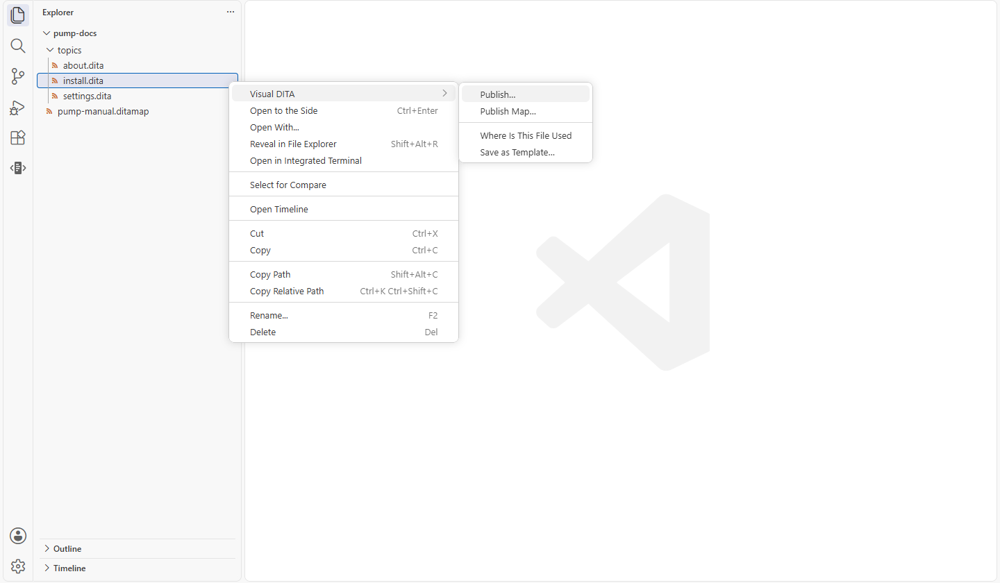
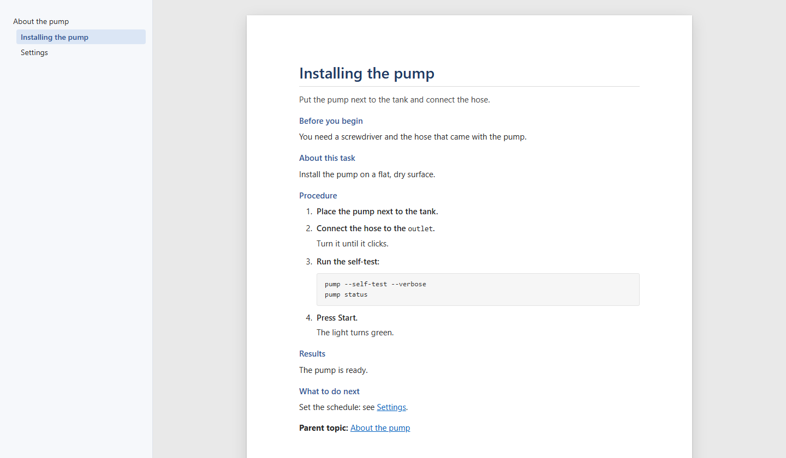
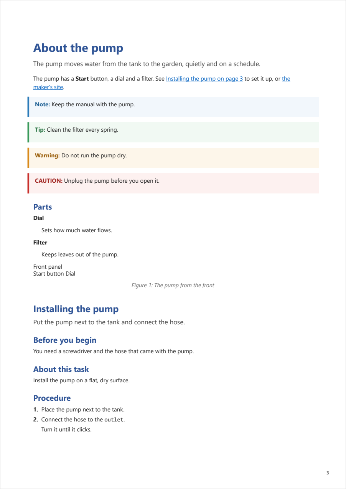

# Publishing

[User guide](README.md) › Publishing

Visual DITA publishes your maps with DITA-OT, DITA's open-source publishing engine, installed on your machine: as HTML5
or as PDF, both looking the way your topics look on the page.

## Before your first publication

DITA-OT is free, and it is not part of Visual DITA: it is installed once, on your computer.

1. Download DITA-OT, version 4 or later, from [dita-ot.org/download](https://www.dita-ot.org/download), and unzip it
   anywhere you like, your Documents folder for instance. It unzips into a folder named `dita-ot-` and its version.
2. DITA-OT runs on Java, version 17 or later. If your computer has no Java yet, install it, for instance from
   [adoptium.net](https://adoptium.net).
3. Publish (below). The first time, Visual DITA says it needs DITA-OT: click **Choose DITA-OT Folder…** and pick the
   folder you unzipped. Visual DITA remembers it, for every project. (**Get DITA-OT**, beside it, opens the download
   page.)

If Java is missing, Visual DITA says so when you publish. The details, for whoever installs DITA-OT another way, are
at the end of this page ([DITA-OT on your machine](#dita-ot-on-your-machine)).

## Publish a map or a topic

**Publish…** publishes the file it is on: right-click a map or a topic in the Explorer and choose **Visual DITA ›
Publish…**, or click the rocket at the top of the editor where the map or topic is open. In the **DITA Map** view,
the rocket on a map's or a topic's row (when you point at it, or its right-click menu) publishes that map, or that
topic alone with the keys of the map it is listed in; when the view shows one map, the rocket in its title bar
publishes it. **Visual DITA: Publish…** in the Command Palette publishes the map that view stands for. On a topic,
**Publish Map…** (the same menus) publishes the map it belongs to, asking which when it is in several.



Then choose:

- the output: **HTML5** (web pages) or **PDF**, both with Visual DITA's look, or any other output your DITA-OT has
  (its plugins' among them), as DITA-OT makes it; for your first PDF, the paper (A4 or Letter), asked once;
- the conditions, when your project has DITAVAL files: one of them, or none (everything in the map).

DITA-OT publishes your files as they are saved. When topics, maps or DITAVAL files you have open have unsaved changes,
Visual DITA asks first: **Save and Publish**, or **Publish Saved Versions** (your changes left out, still unsaved).

Visual DITA remembers both for each map. The result goes to `out/<map>/html5` or `out/<map>/pdf` in your project
(`html5-print` for HTML5 published with `print.ditaval`), and **Open** opens it. Each publication empties its folder
first. HTML5 is laid out as help pages are: every topic's page has the map's contents in a panel beside it, the topic
shown marked (DITA-OT's `nav-toc`, laid out by Visual DITA's stylesheet). A map whose topics are outside its folder
(`maps/manual.ditamap` with its topics in `topics/`) publishes every page into the output, as deep as the map is among
them, so that every link works (DITA-OT's `generate.copy.outer`): its start page is then `maps/index.html`, and
**Open** opens it there. A root map in the topmost folder of its topics has its start page at the top.



What DITA-OT says goes to the Problems panel and onto the page, by the element it is about (on the map when DITA-OT
names no place), as **Visual DITA publishing (DITA-OT)** with DITA-OT's message number. Publishing again replaces
them. DITA-OT's whole output is in the **Visual DITA: DITA-OT** output.

A topic is published alone, into `out/<topic>/…`: with the keys of the map it belongs to resolved in it (Visual DITA
gives DITA-OT a small map that holds the topic and refers to that map for its keys, removed afterwards), and nothing
else of that map. HTML5 has the pages it links to beside it, so its links work. A topic in no map is published without
keys. The DITA-OT parameters for a topic published alone are a setting of their own, `visualDita.publishing.topic`.

A map that is part of a publication, a chapter's own map, say, is published the same way: its topics, with the keys of
the publication it is part of, as they read in Visual DITA.

A link to another publication through its key scope (`<xref keyref="admin.users"/>`, your map referring to the admin
guide as a peer) shows on the page and opens its topic in Visual DITA. DITA-OT, publishing one publication, does not
read the other's keys: such a link is published as its own text, without a link, and as nothing when it has no text.
Give it its text to keep the words (`<xref keyref="admin.users">Managing users</xref>`); to keep a link too, give it the
address of the other publication's published page as well (`href="https://docs.example.com/admin/users.html"
scope="external" format="html"`), which DITA-OT follows when it does not find the key.

### Your own DITA-OT setup

A project already set up for DITA-OT is published as it is set up. **Publish…** first offers the deliverables of your
DITA-OT project files (XML or JSON, anywhere in the project, their includes followed), each by its name, its output type
and its maps, and publishes the one you choose exactly as its file says (`dita --project=<file> --deliverable=<id>`):
nothing of Visual DITA's added, its output in `out/` as DITA-OT run in the project folder puts it. A deliverable
without an id cannot be published alone: its whole file is. A map's own **Publish…** (right-click it in the DITA Map
view) offers the deliverables that publish that map. Below them, **A map, as HTML5, PDF or another output…** is
Visual DITA's own way, above.

### Settings

What Visual DITA publishes with are DITA-OT's own parameters, and they are yours to set, in your project's settings:

- `visualDita.publishing.html5` and `visualDita.publishing.pdf`: DITA-OT's parameters for each output, name → value
  (DITA-OT's documentation lists them: <https://www.dita-ot.org/dev/parameters/>). Visual DITA's defaults for HTML5
  are `"args.copycss": "yes"` and `"args.csspath": "css"` (the stylesheet copied beside the pages), `"nav-toc": "full"`
  (the contents beside every topic) and `"generate.copy.outer": "3"` (every page in the output); for PDF, none. Yours go
  with Visual DITA's: give one another value to change it, or `null` to leave it out.
- `visualDita.publishing.look`: Visual DITA's look (on), or DITA-OT's own (off). On, Visual DITA adds the one parameter
  only it can, where its look is: the stylesheet (`args.css`) for HTML5, the theme (`theme`) for PDF.

Kept in the project, Visual DITA's publications in `publishing/project.xml` follow these settings: when they change, the
next publication rewrites them, so a server publishes as you do. Publications of your own in that file stay as you
wrote them.

### Your PDF

The PDF looks like the page: its fonts, the headings' blue, notes with their coloured bar, code, tables, the task's
sections named as the page names them, the page numbers at the foot and the map's title at the head. Two things stay
DITA-OT's: a table's outer frame, and a note's label at the start of its text rather than above it. Your topics' own
colours and shading (a Word document's, kept as `outputclass`) reach HTML5 only.



Kept in the project (below), the PDF is made with `publishing/theme.yaml`, a DITA-OT theme of your own: it starts with
your paper and extends `publishing/visualdita-theme.yaml`, Visual DITA's look, which Visual DITA writes again when
the look changes. What you set in yours — the paper, margins, a logo on the cover, the header and footer, any style —
goes over Visual DITA's and stays yours; its comments show where to start, and DITA-OT's documentation has every key
(<https://www.dita-ot.org/dev/topics/pdf-themes.html>).

### Publishing on a server

The first time you publish in a project, Visual DITA asks whether to keep what you publish in the project. Kept, each
map you publish, with its output and its conditions, is a deliverable in `publishing/project.xml`, DITA-OT's own project
file, and Visual DITA's look is beside it: the stylesheet for HTML5 (`publishing/visualdita.css`) and the themes for
PDF (`publishing/theme.yaml` over `publishing/visualdita-theme.yaml`). Visual DITA
then publishes through that file, so a DITA-OT anywhere — a build server, a colleague's machine — publishes your maps
exactly as you do:

```
dita --project=publishing/project.xml
```

Each deliverable's output goes to its own folder in DITA-OT's output folder (`out/` unless the server gives another
with `-o`). Commit the `publishing` folder with your topics; at the same moment Visual DITA offers to keep `out/` out of
Git. The file is yours too: Visual DITA only adds a deliverable when you publish a new combination, and leaves the
others, yours included, as they are. A project whose `publishing/project.xml` is already there (a colleague's) is
published through it without asking. A map that is part of a publication (a chapter's) is kept as it is, so DITA-OT
publishes it without its publication's keys: keep the publication's map. **Copy Server Command** in the message after publishing copies the command.

### DITA-OT on your machine

Publishing needs DITA-OT 4 or later, and Java 17 or later to run it. Visual DITA uses the DITA-OT in
`visualDita.ditaOt` (its folder, the one holding `bin`), else the one in `DITA_HOME`, else the `dita` on your PATH.
When it finds none, or no Java to run it, it says so before asking anything: **Get DITA-OT** opens DITA-OT's download
page, **Choose DITA-OT Folder…** sets `visualDita.ditaOt`.

## Publishing another way

DITA-OT run any other way — from the command line, from a build, or from another VS Code extension such as DitaCraft —
can give its HTML5 output the same look.

### Write the stylesheet

Run **Visual DITA: Write Publishing Stylesheet…** from the Command Palette and choose where to save it
(`visualdita.css` in your project, by default). It holds:

- the look of your content as the page shows it: titles, paragraphs, notes and their colours, lists, steps and the
  names of a task's parts ("Before you begin", "Procedure"…), code, tables, figures, links;
- the colours, shading, capitals and alignment your topics keep as `outputclass` (a converted Word document's);
- the numbers of numbered chapters and clauses, as the page counts them: each topic's from your maps, its numbered
  sections and legal lists after it (see [Numbered chapters and clauses](writing.md#numbered-chapters-and-clauses)).

The numbers and colours are your project's at the moment you write it: write it again when your maps or colours
change.

### Give it to DITA-OT

DITA-OT's HTML5 output uses it given three arguments; the message after writing it copies them for you:

```
dita -i your.ditamap -f html5 --args.css=path/to/visualdita.css --args.copycss=yes --args.csspath=css
```

With **DitaCraft** installed, **Use in DitaCraft** in that message adds them to this workspace's
`ditacraft.ditaOtArgs`, replacing a stylesheet given there before; its HTML5 publishing then uses Visual DITA's look.

DITA-OT writes some labels itself ("Note:", "Figure 1."): the stylesheet styles those rather than adding its own, so
they read as DITA-OT words them. Its PDF output does not use CSS: give it the theme instead,
`--theme=publishing/theme.yaml`, once **Publish…** has kept a PDF in the project.
