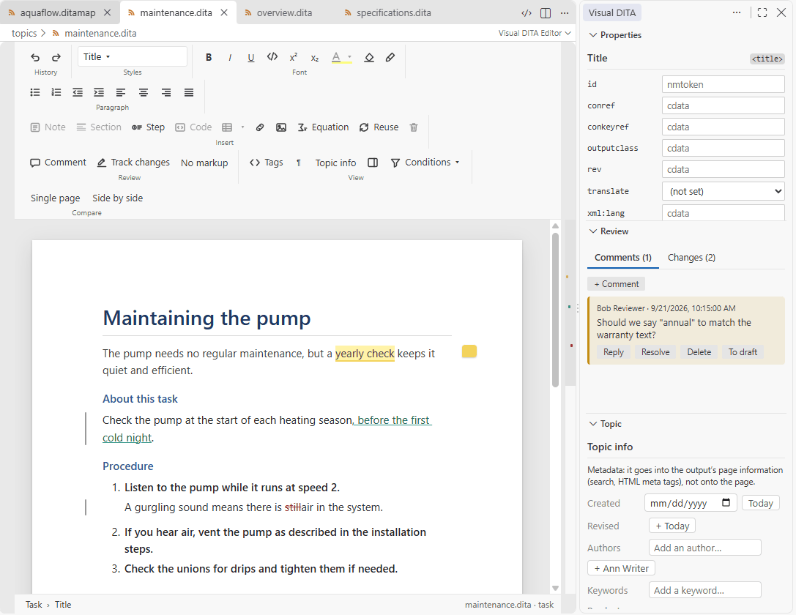
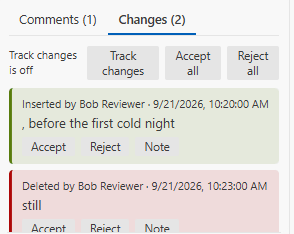
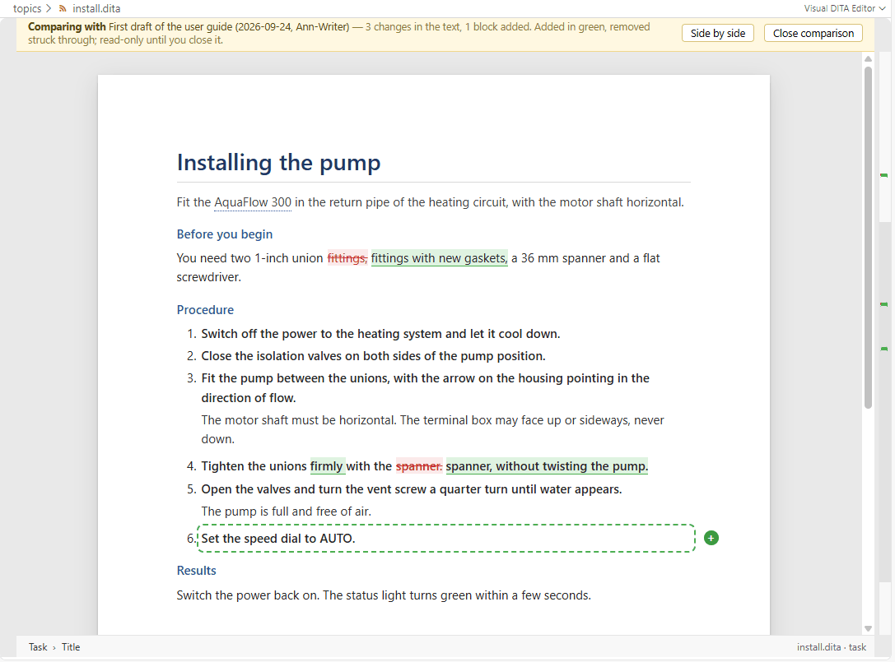
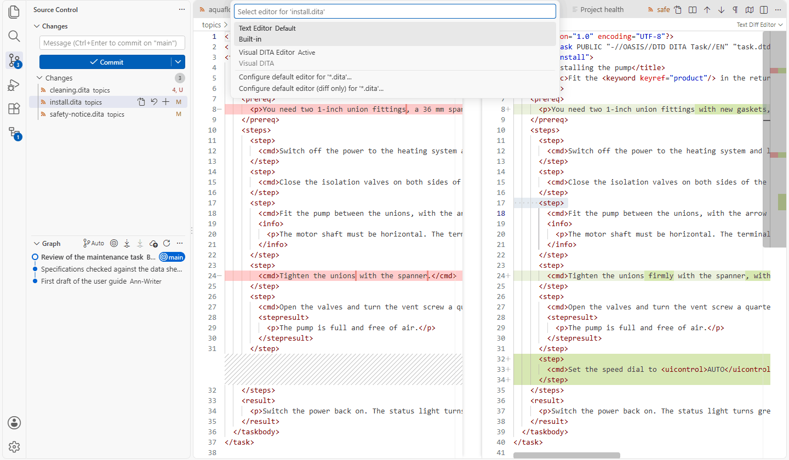

# Review and compare

[User guide](README.md) › Review and compare

Visual DITA offers two ways to see what changed in a topic. They suit different teams, and they work together.

- **Review in the file.** Comments and tracked changes are stored in the topic itself, in the markup Oxygen XML
  uses. They travel with the file, need no Git, and a reviewer in Oxygen sees the same comments and changes.
- **Compare with Git.** Nothing is added to the file. Visual DITA compares the versions Git already keeps — the
  last commit, any earlier one, another branch, what you staged — and shows the differences on the page, on a
  single page or side by side.

| Your team… | Use |
|---|---|
| sends topics out for review, works with Oxygen users, or wants comments on the text | review in the file |
| keeps its content in Git and reviews commits or pull requests | Compare, with Track changes switched off for the project |
| does both | both: a comparison reads a file's tracked changes as accepted, so the two never mix on the page |

- [Review in the file](#review-in-the-file)
  - [Comments](#comments) · [Tracked changes](#tracked-changes) · [No markup](#no-markup) ·
    [Colour highlights](#colour-highlights) · [Maps](#maps) · [In the XML](#in-the-xml) ·
    [Teams that review through Git only](#teams-that-review-through-git-only)
- [Compare with Git](#compare-with-git)
  - [Single page](#single-page) · [Side by side](#side-by-side) ·
    [Diffs from Source Control](#diffs-from-source-control) · [What a comparison marks](#what-a-comparison-marks) ·
    [Comparing a map](#comparing-a-map) · [Comparing with View as on](#comparing-with-view-as-on) ·
    [Tracked changes and comments in a comparison](#tracked-changes-and-comments-in-a-comparison)
- [Not yet](#not-yet)

## Review in the file

Comments, tracked changes and colour highlights are processing instructions — `<?oxy_comment_start …?>`,
`<?oxy_insert_start …?>`, `<?oxy_delete …?>`, `<?oxy_attributes …?>` — exactly as Oxygen XML writes them. A topic
reviewed in Visual DITA opens in Oxygen with its comments and changes intact, and the other way round. Markup you
do not touch is written back byte for byte.

Publishing tools ignore this markup. Comments and highlights never reach the output; inserted text is ordinary
content and deleted text is kept inside its marker, so a topic published with changes still pending reads as if
they were accepted. Accept or reject them before you publish.

Your name on comments and changes is `visualDita.author`; left empty, it is your operating-system user name.

The Review pane has two tabs, **Comments** and **Changes**. By default it sits in the Visual DITA side bar (the
secondary side bar) and follows the topic you are working on; with `visualDita.panes` set to `page` it opens
inside the page instead.

### Comments

**Add one** on the selected words, or at the caret when nothing is selected:

- **Comment** in the ribbon (Review group) or in the mini toolbar over a selection,
- **Ctrl+Alt+M** (Cmd+Alt+M on a Mac),
- right-click → **Add comment**,
- **+ Comment** in the Review pane.

Type the comment and press **Comment** (or Ctrl+Enter). To comment on a whole element — a note, a table, a
section — select it by clicking its name in the breadcrumb at the bottom of the page, then add the comment.



**On the page** a commented passage is highlighted in yellow, and the right margin has an icon for each thread,
with the number of comments still open in it. Click the icon, the highlight's mark in the overview ruler on the
right, or the comment in the Review pane, to go to it.

**In the Review pane** each comment shows its author and date, with:

- **Reply** — replies thread under the comment, and replies to replies nest.
- **Resolve** / **Reopen** — resolving the first comment of a thread resolves its replies too, and reopening it
  reopens them; a reply can be resolved on its own. A resolved thread leaves the page (no highlight, icon or ruler
  mark) and stays in the pane. **Show resolved** brings resolved threads back onto the page, in grey.
- **Delete** — removes the comment and its replies; the commented text stays.
- **To draft** — turns the thread into a DITA `<draft-comment>` in the topic, replies included (each with its
  author and date), for teams that keep review notes as DITA. **To comment** turns such a draft-comment back into
  a comment thread. Draft-comments are listed in the pane too, and an authoring rule notes each one: DITA-OT leaves
  them out of the output unless the build keeps drafts.

Reply, Resolve, Reopen, Delete and the conversions are also on the right-click menu of commented text.

### Tracked changes

**Track changes** (ribbon, Review group; the right-click menu; the Changes tab of the Review pane) switches
recording on and off. Oxygen keeps that choice in the file — `<?oxy_options track_changes="on"?>` — and so does
Visual DITA: a file saved with tracking on opens with tracking on, in either editor, and switching it changes the
file.

**What is recorded**, each change with your name and the time:

- typing, deleting, and typing over a selection (shown as one **Replaced** change),
- pasting, inserting and deleting elements, splitting a paragraph with Enter, table edits,
- attribute changes made in the Properties pane or from the right-click menu, keeping the original value,
- formatting — making words bold, putting them in a `<uicontrol>` — recorded as the old words replaced by the
  formatted ones,
- moving content by drag and drop, recorded as deleted in one place and inserted in the other.

Deleting inside your own insertion simply removes the text; deleting anywhere else, including inside another
author's insertion, is recorded as a deletion. Colour highlights and comments are never recorded, and neither are
undo and redo.

A deletion across paragraphs (or list items, cells, other elements) is recorded in each of them — the words
deleted in the first and the last, whole paragraphs in between — and the paragraphs are not joined, not even once
the deletion is accepted: the review markup has no way to record a join. For the same reason, Backspace at the start
of a paragraph (and Delete at its end) moves the caret to the neighbouring paragraph instead of joining the two.
Deleting commented words keeps the comment, around the deleted words.

**On the page** inserted text is green and underlined, deleted text red and struck through, where it was. An
attribute change has no colour on the page; hovering the element shows the old and new values. Every block with a
change gets a thin grey bar in the left margin, and the overview ruler marks each change. Hovering a change says
who made it.



**In the Review pane** (Changes tab) each change reads *Inserted*, *Deleted*, *Replaced* or *Attributes of …
changed*, by whom and when, with the text or the old and new values. From there, or by right-clicking the change on
the page:

- **Accept** / **Reject** one change. A replacement is accepted or rejected as one; rejecting a deletion brings the
  deleted content back, formatting included; rejecting an attribute change restores the old values.
- **Note** — a note on the change ("why"), as Oxygen has; **Edit note** changes it, and emptying it removes it.
- **Accept all** / **Reject all** — every change in the topic, by every author, at once.

### No markup

**No markup** (ribbon, Review group) shows the topic as if every tracked change were accepted and without
comments: deletions hidden, insertions as plain text, no highlights, margin icons, change bars or ruler marks. The
file keeps everything, you can go on editing, and the Review pane still lists it all. The button is there only when
the topic has comments or tracked changes. It is not remembered: reopening the topic, or anything that reloads the
page (a change to the file from outside, reloading grammars), shows the markup again.

### Colour highlights

The colour palette in the ribbon's Font group and in the mini toolbar paints a background colour on words — eight
colours, and **No colour** to remove it. It is Oxygen's highlight markup: a reviewer's marker pen, shown on the
page, never published and never tracked. **Clear formatting** removes it too.

### Maps

A map carries comments and tracked changes the same way. In the map page, **Comment** (ribbon) or right-click →
**Comment on entry** comments an entry; with **Track changes** on, added, removed and moved entries and attribute
edits are recorded. Entries show a coloured bar — green inserted, red deleted (a struck ghost row), purple
attributes, yellow commented — and the right-click menu has Reply, Resolve, Remove, Accept and Reject. No markup,
highlights, the margin and the ruler are topic-only.

### In the XML

Opened as XML (right-click → **Open Source**), a topic or map shows its review markup in the gutter and the
overview ruler — comments yellow, insertions green, deletions red, attribute changes purple — with the details on
hover.

### Teams that review through Git only

A team that reviews through Git does not want review markup in its files. Switch **`visualDita.trackChanges`** off
in the project's settings (`.vscode/settings.json`):

```jsonc
{ "visualDita.trackChanges": false }
```

Track changes then disappears from the ribbon, the right-click menu and the Review pane, and nothing can switch it
on — not even a file saved with Oxygen's tracking option, which is left as it is in the file. Tracked changes
already in a file still show, to accept or reject, and the authoring rule `tracked` warns about each file that
holds some, in the page and in the Problems panel. Comments stay available: they are not changes to the text.

## Compare with Git

Comparing needs VS Code's built-in Git (on by default) and a topic in a Git repository. The toolbar's last group,
**Compare**, then has two buttons, **Single page** and **Side by side**. Both ask which version to compare with:

- **Last committed version** — the last commit that changed the file,
- an earlier commit from the file's history (message, date, author),
- **Branches** — the file as it is on another local or remote branch.

Your side of a comparison is the topic as it is in the editor, unsaved changes included.

### Single page

**Single page** shows the changes on your page: new words in green, removed ones struck through in red where they
were; a whole new or removed paragraph gets a dashed outline and a **+** or **−** in the right margin, so it never looks
like a note. The bar at the top names the version and counts the changes. The page is read-only while it
compares, so the ribbon steps aside; **Close comparison** (or Single page again) gives it back. **Side by side** in
the bar opens the same two versions next to each other.



### Side by side

**Side by side** opens the version you picked and your file in a diff tab — `task.dita (1a2b3c4) ↔ task.dita` —
both shown as pages:

- left, **Committed version**: what is gone or changed since, struck through in red;
- right, **Your version**: what is new, in green.


The two sides scroll together, kept level on the paragraphs they share, however much longer one of them is. Each
side's overview ruler marks its changes; click one to go there, and the other side follows. Both sides are for
reading — no ribbon, menus or side panes. Tracked changes are shown as accepted there, comments and colour highlights
as you have them. On the right:

- **Edit** opens your file in its own tab, in the same editor group; the diff stays one tab over and follows what
  you change, before you save.
- **Single page** opens your file with the same changes on one page.
- **Close comparison** closes the diff and opens your file on its own page, as **Close comparison** on one page does.

### Diffs from Source Control

Clicking a changed file in the Source Control view opens VS Code's text diff of its XML. To read it as pages, pick
**Visual DITA Editor** in the editor list at the top right of the diff, or run **View: Reopen Editor With…** from
the Command Palette. To have every `.dita` diff open that way, run **View: Reopen Editor With…** once and choose
**Configure default editor (diff only) for '\*.dita'…** → Visual DITA Editor.



Every diff Git offers works:

| Diff | Left | Right |
|---|---|---|
| a changed file (Changes) | the committed version | your file |
| a staged file (Staged Changes) | the last commit | what you staged |
| a commit in the Graph or the Timeline | the commit before | that commit |

When neither side is your working file — staged changes, a commit against its parent — the bars say **Earlier
version** and **Later version**, **Edit** opens the file itself, and there is no Single page. Which side is the
earlier one comes from Git, not from the order the pages opened in.

### What a comparison marks

| On the page | Means |
|---|---|
| green, underlined | words that are new |
| a dashed green outline, **+** in the right margin | a paragraph, list item or other element that is new |
| red, struck through | words that went, drawn where they were |
| struck through in a dashed red outline, **−** in the right margin | a whole paragraph or element that went, drawn where it stood |
| a green row, a struck red row | a table row added, a table row removed (on a single page, drawn among the rows) |
| dotted violet underline | the same words formatted otherwise: bold, italic, a phrase element such as `<uicontrol>`, a link or key pointing elsewhere |
| dashed violet outline | an element whose attributes changed — a note's type, an `@outputclass`, a condition — or that became another element with the same words (a paragraph into a note, or wrapped in one); hover to see which |
| violet frame around an image or formula | an image, formula or drawing (MathML, SVG) that is different in the other version: another picture, a changed formula |
| green frame; a red one on the earlier version | an image, formula or drawing only the later version has; only the earlier one had |
| *Image pic.png*, struck through | an image (or formula, drawing) that went, named where it stood |

Paragraphs, list items and table cells are matched by the words they share, so an edited paragraph reads word by
word, and a paragraph removed beside an edited one does not make both look rewritten. Tables are compared as
tables: rows by what the whole row says, cells in the same column; a new column shows as new cells. The overview
ruler marks new in green, removed in red and formatting, attribute, element, image and formula changes in violet,
and the summary counts them all ("2 images changed, 1 element turned into another").

Not marked:

- the topic's metadata (`<prolog>`) — it is not on the page; the Topic pane shows it,
- a move, which reads as removed in one place and new in the other,
- comments (they are review markup, not content) and XML comments,
- a table's `@cols`, which only follows its columns.

### Comparing a map

A map in a Git repository has **Compare** in its toolbar too: it asks which version, as for a topic, and marks the
map's entries: an entry that is new outlined in green, one that went drawn where it stood and struck through in red
(with how many entries were under it), one that moved outlined in violet and tagged *moved* (where it was, when it
was under another entry). A title that changed reads as words do on a topic: the one it had struck through in red,
then the new one in green; attributes that changed outline the entry in violet, tagged with which (*changed:
@audience*). An entry is known by what it points at (its file, or key), a heading by its title; entries in a
relationship table by their cell. The map
is read-only until you close the comparison. **Side by side** shows it as for a topic: the version on the left with
what went, your map on the right with what is new, scrolling together.

### Comparing with View as on

With a condition set chosen in **View as ▾**, a comparison reads both versions as that set's readers get them. What
the set leaves out of the other version is dimmed or hidden as it is on your page, and labelled with its condition
(*excluded · audience=user*); what changed only there is not counted in the summary. A paragraph that went for
everyone is still drawn as gone. Choosing another set while comparing compares again. Side by side, each side shows
its version as the set's readers get it.

### Tracked changes and comments in a comparison

A comparison reads every version as if its tracked changes were accepted: inserted text counts as there, deleted
text as gone, on both sides. Accepting or rejecting a change therefore shows in a comparison only through the text
it changes, and a tracked change and a comparison are never drawn in the same colours at once:

- While a comparison is open, **single page or side by side** (and diffs from Source Control), the tracked changes
  are shown as accepted — the bar says how many — and closing it brings them back.
- **Comments and colour highlights stay** as you had them, on both sides of a diff too; with No markup on, they are
  hidden there as well.

## Not yet

- A comment's text cannot be edited once sent: delete it and write it again.
- There is no next/previous change command and no per-author filter; Accept all and Reject all cover every author.
- Track changes has no keyboard shortcut; Ctrl+Alt+M (comment) is the only review shortcut.
- In a map: no No markup, highlights, margin or ruler.
