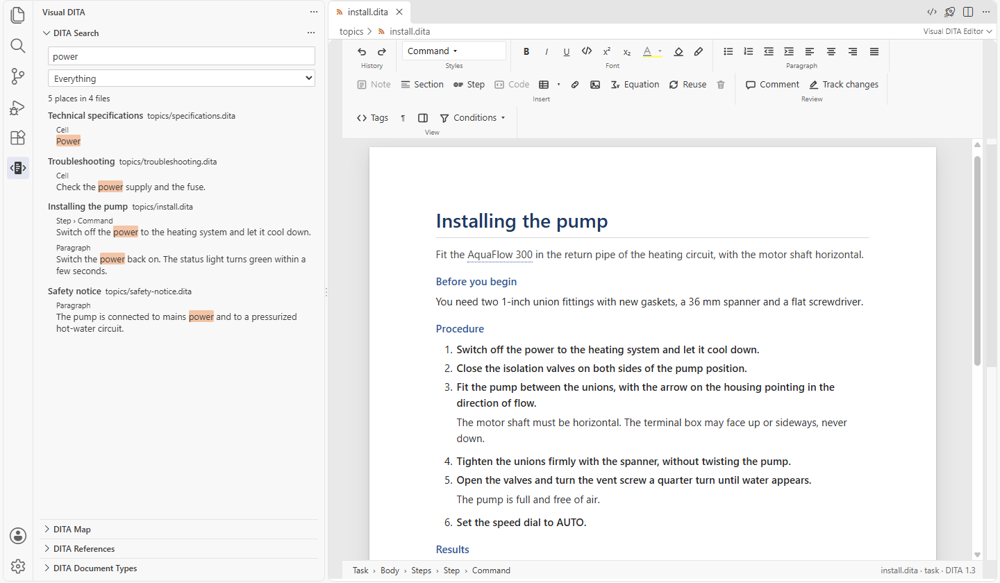
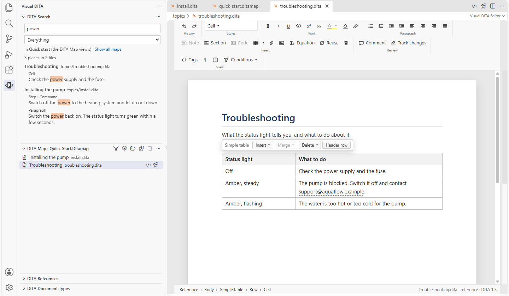

# Searching your content

[User guide](README.md) › Searching your content

**DITA Search**, at the top of the Visual DITA side bar (**Ctrl+Alt+F**, or **Visual DITA: Search DITA…**), searches
the text of your topics and maps as a reader reads it: never inside a tag or an attribute, and with every place found
said for what it is, a title, a step, a note, a table cell.

## Searching

Type in the box: what is found shows as you type, grouped by topic (its title and its file), each place with the
words around it and the words found marked. Click a place, or press Enter for the first: the topic opens with the caret
in that paragraph, title or step.

- **Every word** you type must be there, in any order, with or without capitals and accents. A word also finds the
  longer words it begins: `valve` finds *valves*, `instal` finds *install* and *installation*.
- **"A phrase in quotes"** is found exactly as written.
- **Titles first**: a title that matches comes before a short description, which comes before body text.
- **A word misspelt**: when nothing is found, the nearest word your project uses is searched instead (`presure`:
  *pressure*), and the line above the results says so.

## Keeping to part of the project

- **A kind of element**: titles, short descriptions, notes, steps, lists, tables, code, the glossary. Your own
  specialized elements count as what they specialize, and a paragraph in a note is a note's.
- **A map**: when the **DITA Map** view shows one map alone (you opened it, or chose it there), DITA Search keeps to
  that map's topics, and says so under the box; **Show all maps** searches the whole project again. With every map
  listed in the DITA Map view, the whole project is searched, topics no map uses yet included
  ([Maps: the DITA Map view](maps.md#the-dita-map-view)).

## What is searched

Every topic and map in your workspace folders, except your template folders. Very large files (over 5 MB) are not
searched.

You never have to wait for it or refresh it: what you type is found before you save, and files that change outside
VS Code are found too, a Git pull or branch switch, a folder renamed or deleted, even while VS Code was closed.
Nothing is added to your project. If what is found ever looks out of date, **Visual DITA: Rebuild Project Index**
(also in the DITA Search view's **…** menu) reads your whole project again.

The same knowledge of your project makes **Where Is This File Used**, the **DITA References** view, **Go to Symbol
in Workspace** (**Ctrl+T**), the Explorer's marks, the **Project Health Report** and **Check References** answer at
once.
