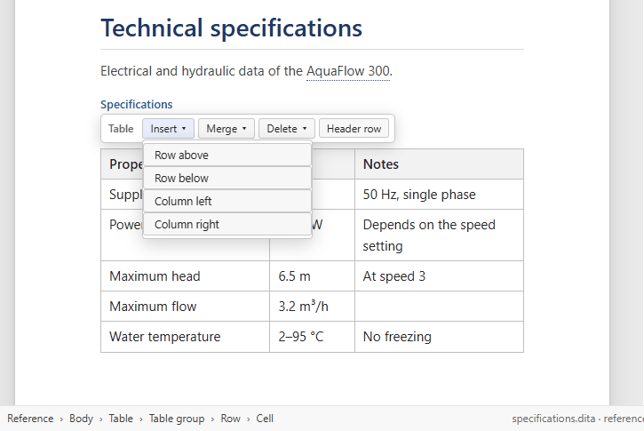

# Tables

[User guide](README.md) › Tables

DITA has two kinds of table, and Visual DITA draws both as real tables.

- A **table** (CALS) can merge cells across rows and columns, and has a title and column specifications.
- A **simple table** (`simpletable`, and the choice tables and properties tables built on it) is a plain grid.

## Insert a table

The **table** button in the Insert group inserts a 3 × 3 CALS table with a header row wherever the document type
allows one; the arrow beside it offers a simple table instead.

## The table bar

With the caret in a table, a bar above it names the kind of table and offers what you can do to it:

- **Insert** — a row above or below, a column left or right.
- **Merge** — the cell with the one to its right or the one below, or split a merged cell again (CALS tables only;
  greyed out in a simple table, which cannot merge).
- **Delete** — the row, the column, or the whole table.
- **Header row** — make the row a header row, or a body row again.

## Moving around and typing

- **Tab** goes to the next cell, **Shift+Tab** to the previous one. Tab in the last cell adds a row.
- **Enter** is a new line inside the cell, in any cell.
- **Ctrl+Enter** leaves the table and continues in a paragraph after it.
- Typing wraps the text in the cell and the row grows, as in Word; the columns keep their widths.

## Widths and alignment

Drag a column border to set its width. It is written the way DITA expresses it: `colspec/@colwidth` in a CALS table,
`@relcolwidth` in a simple table. Alignment (`@align`, `@valign`), frames and rules (`@frame`, `@colsep`,
`@rowsep`) and key columns (`@keycol`) are drawn on the page, and set in the Properties pane.

Next: [Maps](maps.md).
