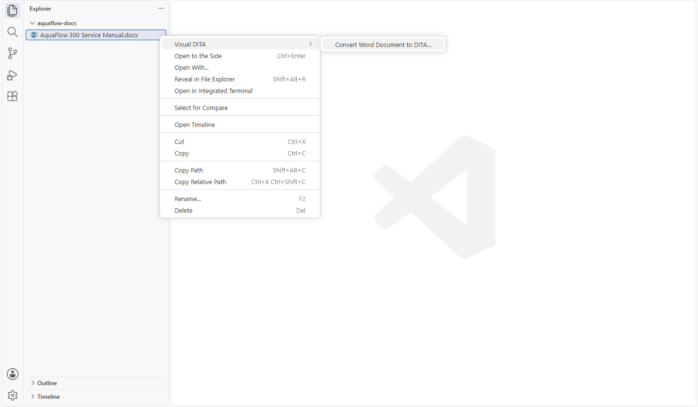
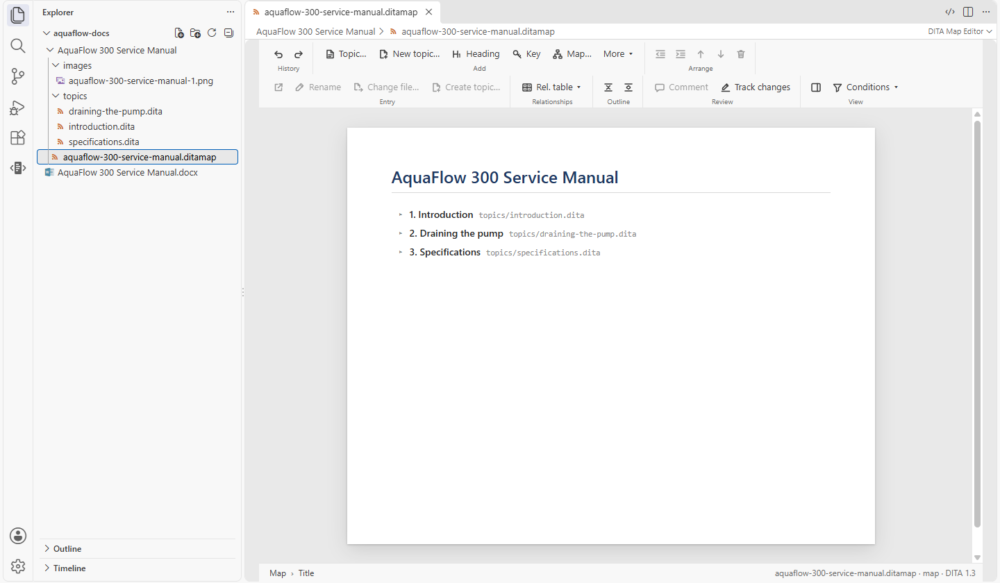
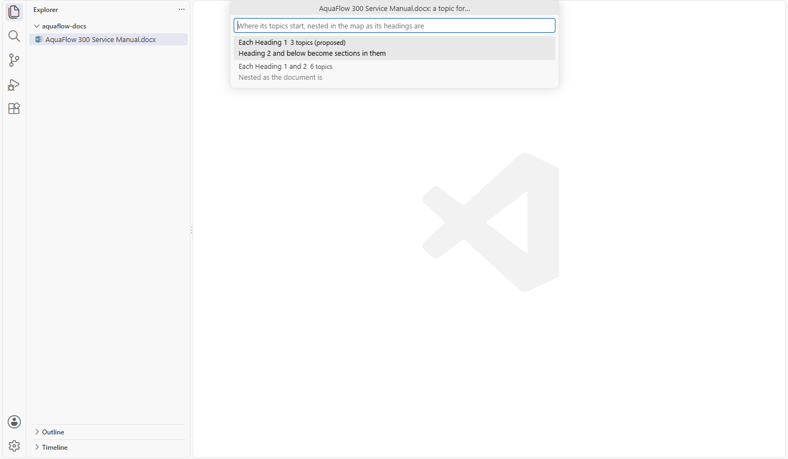
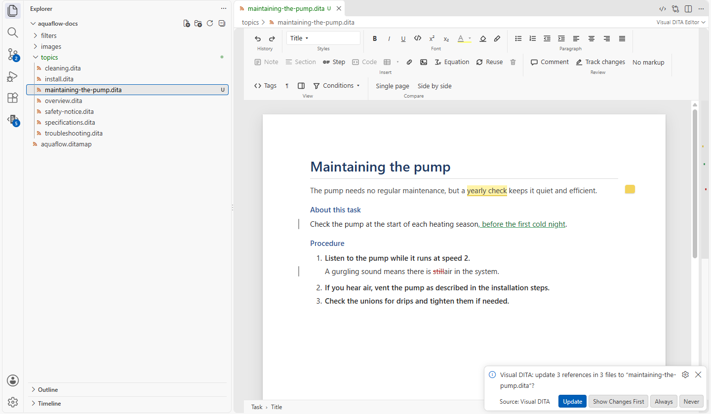
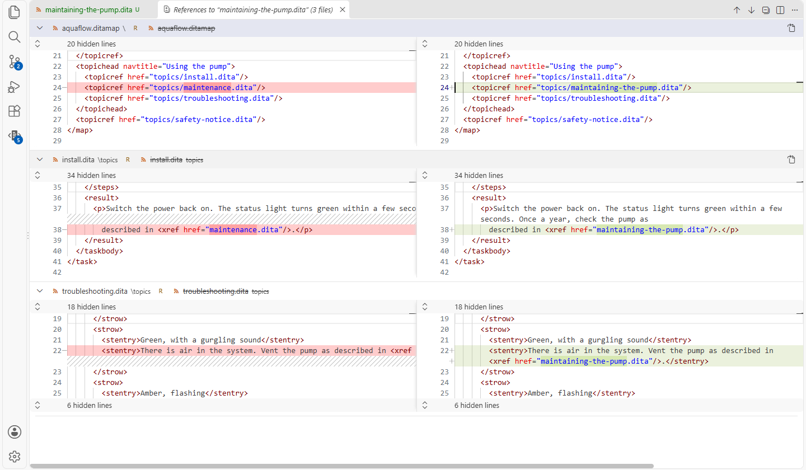

# Writing on the page

[User guide](README.md) › Writing on the page

Visual DITA knows your document type: wherever the caret is, it offers only the elements allowed there, and the
keys do what that place expects. You write; the structure stays valid.

## Typing, Enter and getting out

- **Enter** continues what you are writing: a new paragraph, a new step, a new list item, the next definition. In an
  empty list item or step it steps out of the list, the way a second Enter does in Word. In preformatted text (code,
  screens, `<lines>`) and in a table cell, Enter is a new line. Where no paragraph may follow, Enter makes what your
  document type allows next, such as the next author in the prolog. Where it allows several things, a small menu at
  the caret offers them, the same kind first: Enter again takes it, Escape makes nothing.
- **Related links**: a link that shows its target's title has nothing in it to type into, so a click selects it whole
  and its link bar opens; typing gives it text of its own. **Enter** on a related link (selected, or with the caret in
  its own text) works as in a list: a new link appears right after it, in the same list, and Visual DITA asks what it
  points to. Cancel, and it stays as *Link without a target*: give it one later with **Change…**, or press **Enter**
  on it to leave the related links (it goes, and you are back at the end of the body).
  **Insert → Related link…** (right-click) adds a related link to the topic, the first one too.
- **Ctrl+Enter** leaves the element you are in — a note, a section, a table, a code block — and continues in a
  paragraph after it.
- **Backspace** and **Delete** in an empty element remove the element whole, instead of leaving an empty shell.
- **Tab** and **Shift+Tab** indent and outdent list items, and move between table cells. In a topic's title, Tab
  goes on to its short description.
- A topic without a short description shows a faint **Short description** line under its title: click it (or press
  Tab in the title) and type. Left empty, it goes again, and the file is not changed.

## Styles: what the caret is in

The **Styles** box on the ribbon names the element at the caret (*Paragraph*, *Step*, *Title*…). Its menu turns that
element into another one allowed there (a paragraph into a note, a paragraph into preformatted text), and inserts an
element after it, at the end of its parent, or at the caret. The breadcrumb at the bottom of the page shows the
whole chain of elements; click one to select it.

## The mini toolbar

Select some words and a small toolbar appears over them: bold, italic, underline, code, a highlight colour, clear
formatting, a link, a comment, and **Condition…** to tag the words for an audience or product.

**Format painter** (the brush in the Font group) copies the formatting at the caret — bold, the element such as
`<uicontrol>`, the colour — onto the next words you select; double-click it to paint several times, **Esc** stops.

## Inserting elements

The ribbon's **Insert** group has the common ones: note, section, step, code block, table, link, image, equation,
reuse. Right-click › **Insert** has everything the document type allows at that spot, grouped by where it goes —
inline at the caret, after the current element, at the end of its parent — with **All elements… (Styles list)**
for the rest.

The same right-click menu turns the element into another, deletes it (also **Ctrl+Shift+Delete**), shows where the
topic is used, makes the element reusable (gives it an id to conref), and opens the XML at that place. **Make …
reusable** moves the element into a topic you pick, and says so when that topic's document type does not allow it
there.

## Extracting to a new topic

Select paragraphs, lists, tables, or a whole section, and right-click › **Extract selection to new topic…**; or
right-click a section › **Extract Section to new topic…**. The new topic is written beside this one (a section's title
is its title; a selection asks for one), and what points at the content follows it, the way a refactoring updates
every call site:

- every map that uses this topic gets the new topic under it, after its other entries;
- links and reuse, in this topic and in the others, that pointed into what moved now point at the new topic; a link to
  the section itself opens the new topic;
- in the new topic, links to what stayed behind still point here.

A nested topic is extracted whole — its short description, its prolog, the topics nested in it — and keeps its id:
links into it keep pointing where they did, in the new file. With a map to hold it, nothing is left in its place; in
no map, a link to the new topic is. A reference by key to an
element that moved (`key/element`) cannot follow: it is said, and listed in the Visual DITA output. The new topic is a
plain topic, or one of your topic's own type when its content needs it (your own elements).

The reverse is on the map: right-click an entry › **Inline into parent topic…** (see [Maps](maps.md#an-entry)).

## Pasting from Word and web pages

Copy from Word, a web page or Google Docs and paste on the page: what you get is DITA, not the source's formatting.

- Paragraphs, bold, italic, underline, links, lists (nested as they were) and tables (with their header row) come
  across as themselves.
- A paragraph that starts with **Note:**, **Tip:**, **Important:**, **Caution:** or **Warning:** becomes a note of
  that type.
- Headings become sections, each titled by its heading, where the paste lands in a body that takes sections (an
  empty paragraph in a concept's or topic's body); elsewhere they come in as bold paragraphs.
- A whole document pasted into a new, still empty topic gives the topic its title (Word's **Title** style, or the
  document's only first-level heading).
- Images in what you copied are saved in an `images` folder beside the topic. A caption (Word's **Caption** style)
  makes its image a figure titled by it, or gives the table above or below it its title; the "Figure 1:" in front is
  left to publishing, which numbers them.
- Footnotes become DITA footnotes where they are referenced, **Quote** paragraphs long quotes, and lines in a code
  font (Courier, Consolas) a code block.
- What Word shows but is not content stays out: its table of contents, the numbers of numbered headings and lists,
  and text deleted with Track Changes on. Text inserted with Track Changes on is kept, as if accepted.
- The look DITA keeps comes along, as a converted Word document keeps it: text colour and capitals (as
  `outputclass`), the highlighter (the page's own highlight), a centred or right-aligned paragraph. The black and
  grey a web page gives all its text is not a colour, and stays out.

## Converting a Word document

Right-click a folder in the Explorer › **Visual DITA** › **Import Word Document…** and pick one or more Word documents
(`.docx`): each goes into a new folder in the one you right-clicked, named after it. A Word document already in your
project converts where it is: right-click it › **Visual DITA** › **Convert Word Document to DITA…** (several at once
too), and the new folder is beside it.

Either way the folder holds:

- a map, titled by the document's **Title** (else its first lines when they are centred and bold, else the running
  title of its page footer or header), its topics nested as the headings are, and the copyright the footer states;
- a topic for each of those headings, named after it (`draining-the-pump.dita`); deeper headings become sections. A
  heading over one numbered list becomes a task: the list its steps, **Before you begin** its prerequisites, the text
  before the list its context and what follows its result — unless the list states rather than instructs:
  definitions ("Boat" means…) or clauses titled in bold (**Notice** -- …) keep it a concept. The others are concepts;
- the images, in `images/`.

Where the topics start is yours to choose. For a document with more than one level of headings, Visual DITA asks,
showing how many topics each choice gives: a topic for each Heading 1, for each Heading 1 and 2, and so on down to
every heading, nested in the map as the headings are; the headings below the ones you pick become sections. It
proposes your last choice, else the document's own: each Heading 1 when it has several, each Heading 2 as well when it
has one or none (**Word Conversion: Split**, `visualDita.wordConversion.split`, sets what it proposes until you have
chosen once). A choice that would keep Word's numbers as text says so: a numbered clause made a topic is counted
apart from the clauses left in the text above it. Chapters now and finer later works too: a section becomes a topic
of its own with [Extract selection to new topic](#extracting-to-a-new-topic).

The content comes across as a paste from Word does (lists, tables, notes, figures, footnotes, links; Word's table of
contents left out, its tracked changes accepted), and more of what Word says:

- **Numbers.** Numbered chapters and clauses become what DITA numbers, with no number typed in: a numbered heading a
  numbered entry of the map, a clause under it a numbered section (titled when the clause is a title, around its
  text when it is a sentence), a deeper clause an item of a legal list. See [Numbered chapters and clauses](#numbered-chapters-and-clauses).
  When counting would not give the numbers Word shows (a numbering that starts past 1, a clause 1.1 with no clause 1),
  they are kept as text instead, as Word shows them, and that is said. **Word Conversion: Numbers**
  (`visualDita.wordConversion.numbers`) keeps them as text always, or leaves them out.
- **Lists** stay whole: a paragraph that goes on an item is in that item, a sublist nested in its item. DITA numbers
  every list from 1: a list Word starts at another number is said.
- **A footnote on a heading** goes at the start of the text under it: a DITA 1.3 title takes none.
- **Tables made with tabs.** Lines lined up with tabs become a table when everything says they are one: the same tab
  stops on every line, a bold header row or a column of codes and figures ("$400", "3 days"), and not the letter or
  number of a list in front. A line broken by hand in a cell reads as one line. Columns Word laid side by side on a
  page are read one after the other, and the title and headings every page repeats are kept once.
- **Headings a document only shows.** A document's own styles are its headings where they say so: a style with an
  outline level, or a bold one used only for short lines (a form's own heading style, say). A heading on two lines is
  one; a heading typed in capitals is put in a sentence's case, the words the text itself writes in capitals kept. A
  document without heading styles has its short bold lines as headings, the bigger the higher.
- **Forms typed without Word's lists.** Numbers typed before a tab ("1.", "a.") become lists, nested by how far they
  are indented; a paragraph indented with an item goes on with it. The lines typed above the document's title (a
  form number, the issuer), a "Page 1 of 2", and at the end a copyright or a line repeating them are the page's
  header and footer typed in the text: left out, the copyright going to the map.
- **The look DITA keeps**: text colour, shading and capitals (as `outputclass`, which the page shows and a
  publishing style can map), the highlighter (the page's own highlight), alignment, an image's size and placement,
  a table cell's shading. Fonts, sizes and page breaks are the publishing style's. Hidden text and a form field's
  placeholder text are left out.
- **Equations** become equations, as **Equation** inserts them: select one on the page to edit it.
- **Drawings that are not pictures** — shapes, charts, SmartArt — cannot come across as they are: each is marked
  where it was, by its name, in a red dashed box (DITA's `required-cleanup`). Save it as a picture in Word and put the
  picture there. A text box's words come across as text. Pictures in EMF or WMF (from Visio or older Word) are kept
  but do not show in a browser or most PDF output: the conversion says which; save them as PNG instead.

What was read from how the document looks (a table from tabs, headings from a style or from bold lines, lists from
typed numbers, the header lines left out) is said in the Visual DITA output. Links to places in the document go to the topic that holds them. Nothing that exists is written over: a folder of that name already there makes it `Manual 2`, and a file
that appears in the new folder while it is being written stops the conversion. The map opens when it is done. What did not come across (text boxes,
drawings, fields) is said when it is done, and listed in the Visual DITA output. It is a first draft of your
document in DITA: read it through on the page, and move what belongs elsewhere.

## Numbered chapters and clauses

DITA keeps no numbers in the text: publishing counts them. What is numbered is marked with `outputclass`:

- an entry of a map, `numbered`: numbered among the numbered entries around it, after the number of the numbered
  entry it is in (`6`, `6.1`);
- a section of a topic, `numbered`: after the topic's number (`6.1`, `6.2`);
- the items of a list, `legal`: after the number of the section, or topic, they are in (`6.2.1`); a legal list in an
  item one level deeper (`6.2.1.1`).

The page shows these numbers as they are counted: on the map, and in a topic before its title, its numbered sections
and its clauses. They are not in the text, so they cannot be typed over or go stale. A section added with **Section**
beside numbered sections is numbered too, and the ones after it renumber; a new item of a legal list is numbered by
being there. A converted Word document is written this way. Your publishing style prints the numbers when it counts
`numbered` and `legal` as described here.

## Links, images and reuse

- **Link** (**Ctrl+K**) links the selected words to a topic, or to an element in it, picked from your project; keys
  work too. A link's text and target resolve on the page: a link with no text of its own shows the title of what it
  points at, by key too. With the caret on a link, a small bar shows where it goes, with **Open**, **Change…**,
  **Key…** and **Remove link**. **Open** on a link to an element opens its topic with the caret in that element.
- **Images**: **Image** on the ribbon picks a file, or paste or drop an image onto the page — it is saved in an
  `images` folder next to the topic. Drag a corner to resize it; the size is written as DITA expresses it
  (`@width`, `@scale`, `@scalefit`).
- **Videos and sounds** (`<object>`) show as a card saying what they are and where, with a player: a sound or video
  file of your project plays on the page (mp3, wav, mp4), and **Open** opens it beside the topic. A video another
  site plays (a YouTube embed, Oxygen's `outputclass="iframe"`) plays in the browser: **Open in browser**; YouTube
  refuses its player inside VS Code. Click the card (not the player) and a small bar edits it: its **Address**,
  **Replace…** to pick another video or sound of your project, what it plays (**Video**, **Sound**, **Embedded
  page**: the `outputclass` Oxygen writes), its **Width** and **Height**, and **Delete**. A double-click on the card
  puts you straight in the address. Only what you change is written.
- **Images, videos and sounds from a web server** wait for your word: loading one tells that server the topic was
  opened. A line above the page names each server, with **Load This Time** (this topic, until you close it),
  **Always from …** and **Never**; until then each is a placeholder that says where it comes from. Your answers are
  kept in your own settings (`visualDita.remoteImagesAllowed`, `visualDita.remoteImagesBlocked`), never in a
  project's; `visualDita.remoteImages` decides for the servers you have not answered about: ask, show or never. A
  plain `http:` image, video or sound never loads. Anything else the page is not allowed to load is refused and noted in the status bar, the
  details in the Visual DITA output.
- **Reuse** inserts content written once elsewhere, by key (`conkeyref`) or from a file (`conref`). Reused content
  shows on the page as it will be published, read-only; one click opens its source. An element reuses its own type
  or a specialization of it (a note can reuse a hazard statement, not the other way round), so the element inserted
  is the one the reused content can fill; Visual DITA says so when the reused content has elements your document
  type does not.
- **Keys**: text defined by a key (`<keyword keyref="product"/>`) shows its value, resolved through the map and its
  key scopes.
- **Glossary terms**: right-click › **Insert › Glossary term…** picks a term of your glossary by its words; point at a
  glossary term to see what it means; select words and **Add to Glossary…** to make them a new entry. See
  [Your glossary](glossary.md).
- **Renaming and moving files**: rename or move a topic, map, image or folder in the Explorer, and Visual DITA offers
  to update what points at it — the maps' entries and key definitions, links, reused content, images — and, for a
  file that changes folder, its own references. **Show Changes First** shows every file as it is and as it would be,
  before anything changes; **Always** and **Never** stop the question (the `visualDita.updateReferences` setting).
  References through keys need nothing: only the key's definition in the map changes. Only the references change:
  every other byte of each file stays as it was. A file open with unsaved changes gets the update in its editor, to
  save with the rest of your changes.
- **Renaming an id or a key**: right-click an element with an id › **Rename id…**, or an element with a `keyref` ›
  **Rename key…** (in a map, right-click the entry that defines it): every reference in the project follows —
  links and reuse by path (`file.dita#topic/element`, `#./element`), by key (`key/element`), and a key's every
  `keyref` and `conkeyref`, `scope.key` from outside its scope included. The same name in another key scope is
  another key, and is left alone. Edited as XML, **F2** does the same (see [Checking your content](checking.md)).
  A new name already taken in the topic, or in the key's scope, is refused as you type it. A subject scheme's values
  are not renamed this way: the documents' attribute values would stay behind.

## Equations and drawings

MathML formulas and SVG drawings render as themselves. **Equation** inserts one inline, on its own line, or as a
numbered equation figure. Right-click a formula to write it in LaTeX, with a live preview (it is stored as MathML,
with the LaTeX kept for the next edit), or to edit the MathML itself.

## Conditions

Select words and choose **Condition…** in the mini toolbar to give them an audience, a platform or a product — or a
condition of your own document type (an attribute domain: a `@jobrole` your specialization adds). The values offered
are your subject scheme's, or the ones the project already uses. A value written the generalized way
(`props="jobrole(admin)"`) counts as `jobrole="admin"`. **Conditions ▾** on the ribbon
previews the page through a condition set (`.ditaval`) — what it excludes is greyed out — and **Show condition tags**
labels every conditional element with its values.

## Attributes and the topic's metadata

The **Properties** pane shows the attributes of the element at the caret: allowed values as lists, profiling
attributes with the values in use, everything else as a text field. The topic's metadata (its `<prolog>`) is not on
the published page, so it is not on yours either: it is in the **Topic** pane — created and revised dates, authors
and keywords, the product and its version. **Show on the page as elements** puts it back on the page as it is in the
file. A map's metadata is in the same pane, as Map info (see [Maps](maps.md#the-maps-metadata)).

## Seeing the structure

- **Tags** shows every element's name on the page.
- **¶** (formatting marks) shows where each paragraph ends, which elements are empty, non-breaking spaces, and the
  authoring warnings in the margin.

## Keyboard shortcuts

| Keys | Does |
|---|---|
| Enter | a new paragraph, step or list item; a new line in preformatted text and table cells; elsewhere, what the document type allows next |
| Ctrl+Enter | leave the element (note, section, table…) and continue after it |
| Tab / Shift+Tab | indent or outdent a list item; next or previous table cell |
| Ctrl+B, Ctrl+I, Ctrl+U | bold, italic, underline |
| Ctrl+K | link the selection |
| Ctrl+Alt+M | comment on the selection |
| Ctrl+Shift+Delete | delete the element at the caret |
| Ctrl+Z, Ctrl+Y | undo, redo |

On a Mac, use Cmd instead of Ctrl.

Next: [Tables](tables.md).
