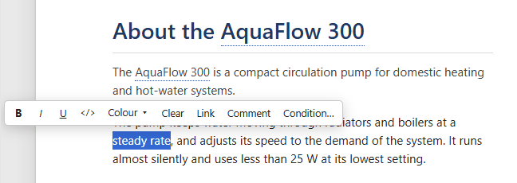
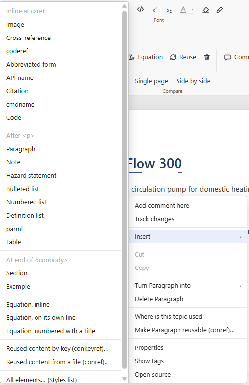
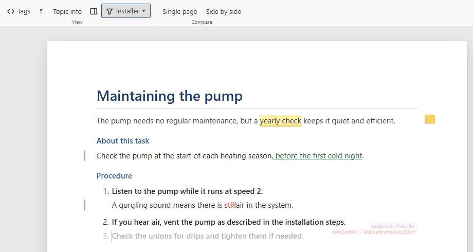
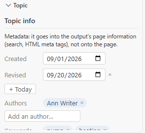

# Writing on the page

[User guide](README.md) › Writing on the page

Visual DITA knows your document type: wherever the caret is, it offers only the elements allowed there, and the
keys do what that place expects. You write; the structure stays valid.

## Typing, Enter and getting out

- **Enter** continues what you are writing: a new paragraph, a new step, a new list item, the next definition. In an
  empty list item or step it steps out of the list, the way a second Enter does in Word. In preformatted text (code,
  screens, `<lines>`) and in a table cell, Enter is a new line.
- **Ctrl+Enter** leaves the element you are in — a note, a section, a table, a code block — and continues in a
  paragraph after it.
- **Backspace** and **Delete** in an empty element remove the element whole, instead of leaving an empty shell.
- **Tab** and **Shift+Tab** indent and outdent list items, and move between table cells. In a topic's title, Tab
  goes on to its short description.
- A topic without a short description shows a faint **Short description** line under its title: click it (or press
  Tab in the title) and type. Left empty, it goes again, and the file is not changed.

## Styles: what the caret is in

The **Styles** box on the ribbon names the element at the caret (*Paragraph*, *Step*, *Title*…). Its menu turns that
element into another one allowed there (a paragraph into a note, a paragraph into preformatted text), and inserts an
element after it, at the end of its parent, or at the caret. The breadcrumb at the bottom of the page shows the
whole chain of elements; click one to select it.

## The mini toolbar

Select some words and a small toolbar appears over them: bold, italic, underline, code, a highlight colour, clear
formatting, a link, a comment, and **Condition…** to tag the words for an audience or product.

**Format painter** (the brush in the Font group) copies the formatting at the caret — bold, the element such as
`<uicontrol>`, the colour — onto the next words you select; double-click it to paint several times, **Esc** stops.

## Inserting elements

The ribbon's **Insert** group has the common ones: note, section, step, code block, table, link, image, equation,
reuse. Right-click › **Insert** has everything the document type allows at that spot, grouped by where it goes —
inline at the caret, after the current element, at the end of its parent — with **All elements… (Styles list)**
for the rest.

The same right-click menu turns the element into another, deletes it (also **Ctrl+Shift+Delete**), shows where the
topic is used, makes the element reusable (gives it an id to conref), and opens the XML at that place.

## Links, images and reuse

- **Link** (**Ctrl+K**) links the selected words to a topic, or to an element in it, picked from your project; keys
  work too. A link's text and target resolve on the page. With the caret on a link, a small bar shows where it goes,
  with **Open**, **Change…**, **Key…** and **Remove link**.
- **Images**: **Image** on the ribbon picks a file, or paste or drop an image onto the page — it is saved in an
  `images` folder next to the topic. Drag a corner to resize it; the size is written as DITA expresses it
  (`@width`, `@scale`, `@scalefit`).
- **Reuse** inserts content written once elsewhere, by key (`conkeyref`) or from a file (`conref`). Reused content
  shows on the page as it will be published, read-only; one click opens its source.
- **Keys**: text defined by a key (`<keyword keyref="product"/>`) shows its value, resolved through the map and its
  key scopes.

## Equations and drawings

MathML formulas and SVG drawings render as themselves. **Equation** inserts one inline, on its own line, or as a
numbered equation figure. Right-click a formula to write it in LaTeX, with a live preview (it is stored as MathML,
with the LaTeX kept for the next edit), or to edit the MathML itself.

## Conditions

Select words and choose **Condition…** in the mini toolbar to give them an audience, a platform or a product. The
values offered are your subject scheme's, or the ones the project already uses. **Conditions ▾** on the ribbon
previews the page through a condition set (`.ditaval`) — what it excludes is greyed out — and **Show condition tags**
labels every conditional element with its values.

## Attributes and the topic's metadata

The **Properties** pane shows the attributes of the element at the caret: allowed values as lists, profiling
attributes with the values in use, everything else as a text field. The topic's metadata (its `<prolog>`) is not on
the published page, so it is not on yours either: it is in the **Topic** pane — created and revised dates, authors
and keywords, the product and its version. **Show on the page as elements** puts it back on the page as it is in the
file. A map's metadata is in the same pane, as Map info (see [Maps](maps.md#the-maps-metadata)).

## Seeing the structure

- **Tags** shows every element's name on the page.
- **¶** (formatting marks) shows where each paragraph ends, which elements are empty, non-breaking spaces, and the
  authoring warnings in the margin.

## Keyboard shortcuts

| Keys | Does |
|---|---|
| Enter | a new paragraph, step or list item; a new line in preformatted text and table cells |
| Ctrl+Enter | leave the element (note, section, table…) and continue after it |
| Tab / Shift+Tab | indent or outdent a list item; next or previous table cell |
| Ctrl+B, Ctrl+I, Ctrl+U | bold, italic, underline |
| Ctrl+K | link the selection |
| Ctrl+Alt+M | comment on the selection |
| Ctrl+Shift+Delete | delete the element at the caret |
| Ctrl+Z, Ctrl+Y | undo, redo |

On a Mac, use Cmd instead of Ctrl.

Next: [Tables](tables.md).
